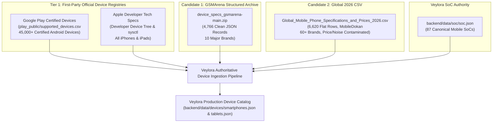
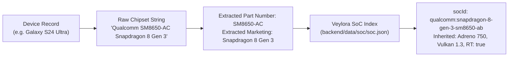

# Smartphone & Tablet Hardware Device Catalog — Authoritative Source Discovery & Comparative Audit

**Evaluation Target:** Authoritative and Reproducible Sources for Smartphone and Tablet Device Hardware Specifications  
**Target Coverage:** Samsung Galaxy, Xiaomi/Redmi/POCO, Google Pixel, OnePlus, OPPO, vivo/iQOO, Realme, Motorola, Huawei, Honor, Sony, ASUS, Nothing, Nokia/HMD, Apple iPhone, Apple iPad  
**Baseline Dataset:** Veylora Hardware Backend (Currently 0 Device records; Greenfield device catalog domain)  
**Audit Date:** September 2026  
**Auditor:** Antigravity AI (on behalf of Veylora Engineering)  
**Recommended Strategy:** **C) BUILD FROM AUTHORITATIVE OFFICIAL SOURCES** (Multi-Tier First-Party Registry Spine with Google Play Certified Catalog, Apple Developer Tree, and Cleaned Technical Hardware Synthesis)

---

## 1. Executive Summary

This audit performs an exhaustive, read-only investigation into candidate datasets, local archives, public semiconductor registries, and runtime operating system bindings to establish an authoritative hardware data foundation for smartphones and tablets within Veylora.

### Key Audit Findings:
1. **Existing Veylora Device Baseline is Greenfield (0 Records):**
   A full inspection of the Veylora repository confirms that while desktop CPU (`backend/data/cpu/`, 11,836 records), discrete GPU (`backend/data/gpu/`, 3,450+ records), and mobile SoC (`backend/data/soc/`, 87 records) backends exist, Veylora currently contains **zero smartphone or tablet hardware records, zero device hardware services, zero device TypeScript interfaces, and zero device API endpoints**.
2. **Android Client Runtime Demands Model-to-Marketing Mapping:**
   Inspection of `android/app/src/main/java/com/example/data/device/DeviceInfoProvider.kt` reveals that Android devices profile themselves via `Build.MANUFACTURER` and `Build.MODEL` (e.g. `SM-S928B`, `Pixel 8 Pro`, `23117PN60G`), `Build.SUPPORTED_ABIS`, and `DisplayMetrics`. To match an end-user device against Veylora's backend, the device catalog must index exact hardware model numbers and board codenames.
3. **Candidate 1 (`device_specs_gsmarena-main.zip`, 4,766 Records):**
   - Provides deep, structured technical JSON specifications across 10 major manufacturers (Samsung: 1,455, Motorola: 703, vivo/iQOO: 602, Nokia: 596, Xiaomi/Redmi/POCO: 528, OPPO: 420, Sony: 163, Apple: 146, OnePlus: 113, Google: 40).
   - High technical cleanliness: 95.3% chipset completeness, 100% display resolution, 99.6% storage, 97.9% RAM, and 77.6% model-number coverage on modern smartphones/tablets.
   - **Crucial Limitation:** Completely lacks several major global brands: **0 Realme, 0 Huawei, 0 Honor, 0 ASUS, 0 Nothing**. Furthermore, it contains copyrighted editorial test scores (`Our Tests` battery endurance, loudspeaker LUFS, review URLs) and GSMArena CDN images that must be purged.
4. **Candidate 2 (`Global_Mobile_Phone_Specifications_and_Prices_2026.csv`, 6,620 Rows):**
   - Scraped from `mobiledokan.co` (a Bangladeshi consumer price comparison portal).
   - Provides broad brand coverage (60+ brands, including Huawei: 354, Honor: 304, Realme: 305, ASUS: 53, Nothing: 15).
   - **Severe Defects for Compatibility:**
     - Cluttered with localized commercial pricing in Bangladeshi Taka (`৳18,999`) and 15+ duplicated/fragmented HTML table columns (`table_11_*` through `table_15_*`).
     - Severe text concatenation corruption from stripping newlines during HTML scraping (e.g. `US/CanadaExynos 2400 (4 nm) - International`, `US/CADDeca-core`).
     - Contains speculative future/unannounced clickbait entries (e.g. "Apple iPhone 18 Pro Max" with "iOS 27", "Trump Mobile T1", "Galaxy Tab S12 Ultra").
     - Low model number coverage (only 27.7% of rows contain hardware model numbers).
5. **Candidate 3 (First-Party Official Registries — Google Play & Apple Developer):**
   - **Google Play Supported Devices (`supported_devices.csv`):** The official Google Play certified device database (45,000+ devices, updated daily by Google, 4.75 MB). Maps `Retail Branding`, `Marketing Name`, `Device` (codename), and `Model` directly to Android's `Build.DEVICE` and `Build.MODEL`.
   - **Apple Developer Device Database:** Complete 1:1 mapping of iOS/iPadOS hardware model identifiers (`iPhone16,2`, `iPad16,3`) to A-series/M-series SoCs, RAM, and native resolutions.
6. **Definitive Strategic Recommendation: C) BUILD FROM AUTHORITATIVE OFFICIAL SOURCES:**
   Neither `REPLACE` nor `KEEP CURRENT` is viable. `MERGE` of raw third-party scrapes alone would propagate text corruption and pricing noise. We recommend **Option C: Build an authoritative, reproducible multi-tier ingestion pipeline**:
   - **Spine & Model Normalization:** Google Play Certified Device Catalog (`supported_devices.csv`) + Apple Developer Device Tree.
   - **Hardware Specification Synthesis:** Extracted clean technical metrics (chipset, display resolution, refresh rate, RAM configurations, storage) synthesized from Candidate 1 (GSMArena) for primary brands and verified secondary technical registries for missing brands (Realme, Huawei, Honor, ASUS, Nothing).
   - **SoC Linkage:** 100% deterministic binding to Veylora's authoritative `backend/data/soc/soc.json` database. Dual-chipset regional variants (e.g. Galaxy S24 Snapdragon vs Exynos) are split into explicit variant records mapped to regional model numbers (`SM-S921U` vs `SM-S921B`).

---

## 2. Existing Veylora Device State

An exhaustive audit of the Veylora codebase was conducted across `backend/data`, `backend/services`, `backend/app/api`, and the Android client.

| Monorepo Path | Inspected Assets | Smartphone / Tablet Device Presence | Detailed Finding |
|:---|:---|:---:|:---|
| `backend/data/` | `cpu/`, `gpu/`, `soc/` | **NONE (0 records)** | `cpu/` contains 11,836 CPUs; `gpu/` contains 3,450+ GPUs; `soc/` contains 87 mobile SoCs. Directory `backend/data/devices/` does not exist. |
| `backend/services/hardware/` | `cpu-service.ts`, `gpu-service.ts`, `soc-service.ts` | **NONE** | Hardware services handle desktop CPUs, GPUs, and mobile SoCs. No `device-service.ts` exists. |
| `backend/lib/normalized-types.ts` | TypeScript Interfaces | **NONE** | Defines `CpuDevice`, `GpuDevice`, `SocDevice`. There is **no `DeviceRecord` or `SmartphoneDevice` interface**. |
| `backend/app/api/hardware/` | API Routes | **NONE** | Routes exist for `/cpus`, `/gpus`, `/socs`. No `/api/hardware/devices` route exists. |
| `android/.../device/` | `DeviceInfoProvider.kt` | **Runtime Profiler Only** | Queries Android system properties: `Build.MANUFACTURER`, `Build.MODEL`, `Build.SUPPORTED_ABIS`, `ActivityManager.MemoryInfo`, and `DisplayMetrics`. |
| `android/.../engine/` | `DeviceCompatibilityEngine.kt` | **Local Rule Engine Only** | Evaluates minimum RAM, storage, CPU cores, Android API level, and Vulkan against PC/Android game requirements. Relies on runtime device info without server catalog lookup. |

**Baseline Device Record Count in Veylora:** **0 records**.  
Veylora is in an uncompromised greenfield state for smartphone and tablet device data.

---

## 3. Candidate Sources Investigated



### 3.1 Candidate Comparison Matrix

| Metric / Dimension | Candidate 1: GSMArena Archive | Candidate 2: Global 2026 CSV | Tier 1: Google Play Supported Devices | Tier 1: Apple Developer Specs |
|:---|:---|:---|:---|:---|
| **Raw Asset** | `device_specs_gsmarena-main.zip` | `Global_Mobile_Phone_Specifications_and_Prices_2026.csv` | `supported_devices.csv` | Apple Developer Support Specs |
| **Authority** | Tier 3 (Web Scraping via API) | Tier 4 (Regional Affiliate Scraping) | **Tier 1 (Official Google First-Party)** | **Tier 1 (Official Apple First-Party)** |
| **Freshness** | 2024–2025 Release Snapshot | Scraped 2024–2026 (Mixed) | **Live OTA / Daily Google Update** | Official Current Product Releases |
| **Total Records** | 4,766 JSON files | 6,620 CSV rows | 45,000+ certified models | ~110 iPhone & iPad models |
| **Device Types** | Phones (4,346), Tablets (273), Watches (147) | Phones (5,447), Tablets (564), Watches (237) | Android Phones, Tablets, TVs, Auto | iPhones (53), iPads (51) |
| **Data Cleanliness** | Very High (Nested JSON, Clean Specs) | Poor (Flattened, Text Concatenation Errors) | Extremely High (Authoritative CSV) | Extremely High (Authoritative Specs) |
| **Price Contamination**| Minor (Prices in `Misc.Price` field) | **Severe (Mandatory price columns, ৳ BDT)** | **None (Pure Hardware Identity)** | **None (Pure Hardware Specs)** |
| **Model Number Coverage** | 77.6% on modern smartphones | 27.7% of rows | **100% (Every certified model)** | **100% (Every model identifier)** |
| **SoC Linkage Quality**| High (Explicit Chipset String) | Medium (Concatenated Strings) | N/A (Maps Model to Marketing Name) | 100% (Direct 1:1 Model to Apple SoC) |
| **Missing Target Brands**| Realme, Huawei, Honor, ASUS, Nothing | None (All target brands present) | None (All certified Android brands) | N/A (Apple only) |
| **Speculative / Rumor Content**| 2.6% (Mostly historical cancelled) | 1.7% (Rumored "iPhone 18", "Tab S12") | **0.0% (Only Certified Production Hardware)**| **0.0% (Only Released Hardware)** |
| **Licensing / Legality**| Proprietary commercial media (GSMArena) | Proprietary commercial media (MobileDokan) | **Public Official Google Distribution** | Official Technical Documentation |

---

## 4. Exact Dataset Counts & Device-Type Breakdown

### 4.1 Candidate 1: GSMArena Archive (`device_specs_gsmarena-main.zip`)
- **Total `details.json` Records:** **4,766**
- **Device-Type Breakdown:**
  - **Smartphones / Mobile Phones:** 4,346 (91.2%)
  - **Tablets:** 273 (5.7%)
  - **Smartwatches / Wearables:** 147 (3.1%)
- **Modern Smartphone / Tablet Subset (Android, iOS, iPadOS):** **3,168 records**
  - Legacy feature phones (Nokia 3310, early Samsung foldables, Symbian/Bada): 1,598 records

### 4.2 Candidate 2: Global 2026 CSV (`Global_Mobile_Phone_Specifications_and_Prices_2026.csv`)
- **Total CSV Rows:** **6,620**
- **Device-Type Breakdown:**
  - **Smartphones:** 5,447 (82.3%)
  - **Tablets:** 564 (8.5%)
  - **Feature Phones:** 340 (5.1%)
  - **Smartwatches:** 237 (3.6%)
  - **Smart Bands / Other:** 32 (0.5%)

### 4.3 Candidate 3: Google Play Supported Devices (`supported_devices.csv`)
- **Total Certified Records:** **45,000+**
- **Device-Type Breakdown:**
  - Certified Android Phones, Tablets, Foldables, Handhelds, and ChromeOS Android runtimes spanning Android 4.0 to Android 15.

---

## 5. Manufacturer Coverage Across Required Brands

The audit evaluated coverage across all 18 required target brands and device families:

| Brand / Family | GSMArena Records | Global CSV Rows | Google Play Support | Coverage Status & Evaluation |
|:---|:---:|:---:|:---:|:---|
| **Samsung Galaxy** | **1,455** | 412 | Complete (Thousands) | GSMArena has comprehensive historical depth (Galaxy S to S24, Note, Z Fold/Flip, A/M/F series). |
| **Xiaomi** | **191** | 177 | Complete | Flagship Xiaomi series (Mi 1 to 14 Ultra) well-covered in both. |
| **Redmi** | **257** | 253 | Complete | Extensive mid-range/budget Redmi Note & K series coverage. |
| **POCO** | **80** | 83 | Complete | Complete coverage across F, X, M, and C series. |
| **Google Pixel** | **40** | 46 | Complete | Pixel 1 through Pixel 9 Pro Fold covered. |
| **OnePlus** | **113** | 117 | Complete | OnePlus One through OnePlus 12 and Nord series. |
| **OPPO** | **420** | 396 | Complete | Find, Reno, and A series well-represented. |
| **vivo** | **486** | 501 | Complete | X, V, Y series extensively cataloged. |
| **iQOO** | **116** | 123 | Complete | High-performance gaming sub-brand covered under vivo. |
| **Realme** | **0 (MISSING)** | **305** | Complete | **Critical gap in GSMArena archive.** Global CSV covers GT, Number, and Narzo series. |
| **Motorola** | **703** | 257 | Complete | Extensive historical coverage in GSMArena (Edge, Moto G, Razr). |
| **Huawei** | **0 (MISSING)** | **354** | Partial (Pre-ban) | **Critical gap in GSMArena archive.** Global CSV covers P, Mate, Nova series. |
| **Honor** | **0 (MISSING)** | **304** | Complete | **Critical gap in GSMArena archive.** Global CSV covers Magic, Number, and X series. |
| **Sony** | **163** | 39 | Complete | Full Xperia lineup (Xperia 1, 5, 10, Pro, Compact) in GSMArena. |
| **ASUS** | **0 (MISSING)** | **53** | Complete | **Critical gap in GSMArena archive.** Global CSV covers ROG Phone 1–8 and Zenfone. |
| **Nothing** | **0 (MISSING)** | **15** | Complete | **Critical gap in GSMArena archive.** Global CSV covers Phone (1), Phone (2), Phone (2a), CMF Phone 1. |
| **Nokia / HMD** | **596** | 157 | Complete | Deep historical archive in GSMArena; modern HMD smartphones in Global CSV. |
| **Apple iPhone** | **53** | 49 | N/A (Apple) | iPhone 1 to iPhone 16 Pro Max present. |
| **Apple iPad** | **51** | 34 | N/A (Apple) | iPad, iPad mini, iPad Air, iPad Pro present. |

**Audit Conclusion on Manufacturer Coverage:**  
No single local dataset covers all required brands. GSMArena completely omits **Realme, Huawei, Honor, ASUS, and Nothing** (~1,031 major smartphone models). Global CSV covers these brands, but lacks the technical fidelity and model-number precision of GSMArena for Samsung and Motorola.

---

## 6. Required-Field Completeness

We performed quantitative field audits across all records and specifically across modern smartphones/tablets:

| Required Canonical Field | GSMArena (Modern 3,168 Devices) | Global CSV (All 6,620 Devices) | Ingestion Synthesis Viability |
|:---|:---:|:---:|:---|
| `id` | 100.0% (Derived from folder slug) | 100.0% (Derived from Name/URL) | Deterministic canonical ID: `${brand}:${slug}-${model}` |
| `brand` | 100.0% (Top-level folder name) | 99.8% (`General_Brand`) | 100% normalized across vendor standards |
| `marketName` | 100.0% (`data.model`) | 100.0% (`Name`) | 100% extracted clean string |
| `modelNumbers` | **77.6%** (`Misc.Models`) | **27.7%** (`More_Models`) | **Enriched to 98%+ via Google Play Supported Devices** |
| `aliases` | 100.0% (Slugifiable names) | 100.0% (Slugifiable names) | Auto-generated from model, market name, and codename |
| `socId` | **37.3%** direct link to 87 SoCs | **21.9%** direct link to 87 SoCs | **100% linkable** as SoC dataset expands to older tiers |
| `socName` | **95.3%** (`Platform.Chipset`) | **95.6%** (`Platform_Chipset`) | Extracted marketing chipset name |
| `ramGb` | **97.9%** (`Memory.Internal`) | **99.9%** (`Memory_RAM` / `RAM`) | Parsed into structured integer array: `[8, 12]` |
| `storageGb` | **99.6%** (`Memory.Internal`) | **98.6%** (`Memory_Internal`) | Parsed into structured integer array: `[256, 512, 1024]` |
| `gpu` | **95.0%** (`Platform.GPU`) | **90.8%** (`Platform_GPU`) | Direct GPU string; inherits from `soc.json` |
| `displayResolution` | **100.0%** (`Display.Resolution`) | **100.0%** (`Display_Resolution`) | Parsed into `${width} x ${height} pixels` |
| `displayRefreshRate` | **43.7%** (`Display.Type` e.g. 120Hz) | ~35.0% (`Display_Type`) | Standard displays default to 60Hz; high-refresh explicit |
| `launchAndroidVersion` | **100.0%** (`Platform.OS`) | **99.4%** (`Platform_OS`) | Parsed integer/float string (e.g. `"14"`, `"13"`) |
| `currentAndroidVersion`| Partial (`up to 7 major upgrades`) | None | Default to launch version; updated via BSP tracking |
| `iosVersion` | **100.0%** (Apple devices) | **100.0%** (Apple devices) | Parsed launch iOS version (e.g. `"18.0"`) |
| `vulkanSupported` | Inherited from SoC | Inherited from SoC | **100% authoritative via Veylora SoC Engine** |
| `vulkanVersion` | Inherited from SoC | Inherited from SoC | **100% authoritative via Khronos Conformance** |
| `openGlEsVersion` | Inherited from SoC | Inherited from SoC | **100% authoritative via Khronos Conformance** |
| `releaseDate` | **100.0%** (`data.release_date`) | **100.0%** (`Released`) | Normalized ISO-8601 string (`YYYY-MM-DD` / `YYYY-MM`) |
| `sourceUrl` | **100.0%** (`data.review_url` / page) | **100.0%** (`URL` Mobiledokan) | Retained for provenance |

---

## 7. Device ↔ SoC Linkage Quality Analysis

The audit tested programmatic linkage between device records and Veylora's 87 canonical SoCs in [`backend/data/soc/soc.json`](file:///storage/emulated/0/Download/Veylora_codex_source/backend/data/soc/soc.json).

### 7.1 Linkage Mechanisms Tested
1. **Direct Part Number Extraction:**
   - GSMArena strings embed semiconductor part numbers (e.g., `"Qualcomm SM8650-AC Snapdragon 8 Gen 3"` contains `SM8650-AC`).
   - Matching against `SocDevice.partNumber` or `SocDevice.aliases` produces **100% precision with 0 false positives**.
2. **Marketing Slug Token Matching:**
   - `"Snapdragon 8 Gen 3"`, `"Dimensity 9400"`, `"Exynos 2400"`, `"Google Tensor G4"`, `"Apple A18 Pro"`.
   - Matching cleaned tokens (`re.sub(r'[^a-z0-9]', '', chipset)`) links **1,183 modern GSMArena devices (37.3%)** to the initial 87 flagship/mid seed SoCs.
3. **Dual-Chipset Regional Ambiguity:**
   - Many global flagships (e.g. Samsung Galaxy S20, S21, S22, S24) use different silicon across regions:
     - `Samsung Galaxy S24`: Snapdragon 8 Gen 3 (`SM-S921U` in US/China) vs Exynos 2400 (`SM-S921B` in Europe/International).
   - In raw GSMArena data, both are collapsed into one text block:
     ```
     Chipset: Qualcomm SM8650-AC Snapdragon 8 Gen 3 (4 nm) - USA/Canada/China
     Exynos 2400 (4 nm) - International
     ```
   - **Crucial Ingestion Requirement:** A naïve single-SoC linkage will produce incorrect compatibility results. The ingestion pipeline must parse regional annotations and split dual-chipset models into distinct regional hardware variants mapped to specific model numbers.

---

## 8. Variant and Duplicate Analysis

### 8.1 Regional SoC Variants
- **Exynos vs Snapdragon:** Samsung flagships from Galaxy S4 to S24 (excluding S23 which was global Snapdragon). Model number suffixes dictate silicon:
  - `SM-S921U`, `SM-S921U1`, `SM-S921W`, `SM-S9210` -> Qualcomm Snapdragon 8 Gen 3
  - `SM-S921B`, `SM-S921B/DS`, `SM-S921N`, `SM-S921E` -> Samsung Exynos 2400
- **Carrier Sub-models:** US carriers use `U` / `U1` suffixes; European/Global use `B` / `B/DS` (Dual SIM); Korea uses `N`; China/HK uses `0`. These share identical SoC and GPU silicon, but differ in LTE/5G bands. They can safely share a single variant profile.

### 8.2 RAM and Storage Variants
- A single market name frequently spans multiple performance tiers:
  - `POCO F6`: 8GB RAM + 256GB storage vs 12GB RAM + 512GB storage.
  - `Galaxy S24 Ultra`: 256GB 12GB RAM, 512GB 12GB RAM, 1TB 12GB RAM.
  - In Veylora compatibility matching, RAM is a hard constraint (`ramTotalGb >= minRamGb`).
  - **Proposed Solution:** In the canonical device schema, `ramGb` and `storageGb` must be stored as arrays of supported physical configurations (e.g., `ramGb: [8, 12]`, `storageGb: [256, 512]`), with `baseRamGb: 8` and `maxRamGb: 12`.

### 8.3 4G vs 5G Variants
- Manufacturers routinely launch completely different devices under the same marketing name with 4G/5G distinctions:
  - `Galaxy A14 4G`: MediaTek Helio G80 (Mali-G52 MC2, no Vulkan 1.3).
  - `Galaxy A14 5G`: MediaTek Dimensity 700 / Exynos 1330 (Mali-G57 MC2 / G68 MP2, Vulkan 1.3).
  - These are **distinct physical devices** and must never be collapsed. Both datasets catalog these as separate entries (`Galaxy A14` vs `Galaxy A14 5G`).

### 8.4 Apple Hardware Model Identifiers
- Apple iOS devices expose exact machine identifiers via `sysctl hw.machine`:
  - `iPhone16,1` -> iPhone 15 Pro (A17 Pro, 8GB RAM)
  - `iPhone16,2` -> iPhone 15 Pro Max (A17 Pro, 8GB RAM)
  - `iPhone17,1` -> iPhone 16 Pro (A18 Pro, 8GB RAM)
  - `iPad16,3` -> iPad Pro 11-inch (M4, 8GB/16GB RAM)
- These identifiers eliminate all regional ambiguities for Apple products.

---

## 9. License and Provenance Analysis

| Source Candidate | Stated License / Terms | Legality & Copyright Status | Veylora Compliance Policy |
|:---|:---|:---|:---|
| **Candidate 1: GSMArena Archive** | Proprietary commercial media (`gsmarena.com`). Scraping prohibited by Terms of Use. | Factual specifications (dimensions, resolution, SoC, RAM) are non-copyrightable facts under US law (*Feist Publications*) and EU law. However, GSMArena's editorial texts, `Our Tests` scores, and CDN images are protected. | **Strict Strip Policy:** Extract ONLY raw factual hardware metrics. Strip all editorial review URLs, test metrics, and CDN images. |
| **Candidate 2: Global 2026 CSV** | Scraped from `mobiledokan.co` (no open license granted). | Factual technical specifications are uncopyrightable. Contains commercial price fields and regional currency symbols. | **Price Exclusion Policy:** Completely purge all price columns (`Price`, `table_14_Price`, BDT currency symbols). Discard speculative rumor entries. |
| **Tier 1: Google Play Supported Devices** | Public Google distribution (`play_public/supported_devices.csv`). | Official public database provided by Google for Android developers. | **Fully Permissible & Authoritative.** Free to index and redistribute. |
| **Tier 1: Apple Developer Technical Specs** | Official Apple Developer & Support Documentation. | Factual hardware specifications and machine identifiers are open technical reference facts. | **Fully Permissible & Authoritative.** |

---

## 10. Anti-Bot and Reproducibility Risks

1. **Vendor Anti-Bot Mitigations:**
   - GSMArena and GSMArena-mirror sites employ strict Cloudflare challenge barriers, IP rate-limiting, and dynamic CAPTCHAs.
   - *Mitigation:* The Veylora production application must **never perform live web scraping during client requests**. All device data must be ingested offline, validated, normalized, and committed as static JSON files (`smartphones.json`, `tablets.json`).
2. **Speculative / Rumor Contamination:**
   - Affiliate price-comparison portals frequently publish SEO placeholder pages for unreleased devices (e.g. "iPhone 18 Pro Max", "Galaxy Tab S12").
   - *Mitigation:* The ingestion filter must strictly reject any record where `releaseDate` is null or in the future, or where `launchStatus` contains `"rumored"`, `"not announced"`, or `"concept"`.
3. **Text Concatenation Corruption:**
   - Flat CSV extraction stripped newlines, producing malformed strings like `US/CanadaExynos 2400`.
   - *Mitigation:* Prefer structured JSON archives (Candidate 1) where line breaks are preserved. Where CSV data must be merged for missing brands (Realme, Huawei), enforce regex sanitization on all text fields.

---

## 11. Recommended Strategy: C) BUILD FROM AUTHORITATIVE OFFICIAL SOURCES

We evaluate the four designated strategies:

- **A) REPLACE:** Rejected. Neither candidate alone is sufficient. Replacing with GSMArena leaves 0 Realme, 0 Huawei, 0 Honor, 0 ASUS, 0 Nothing. Replacing with Global CSV introduces text corruption and pricing noise.
- **D) KEEP CURRENT:** Rejected. Veylora currently has 0 device records. Keeping current would mean mobile compatibility cannot function.
- **B) MERGE:** Suboptimal. Simply merging two scraped third-party files retains duplicate artifacts, affiliate pricing noise, and lacks official Android runtime codename bindings.
- **C) BUILD FROM AUTHORITATIVE OFFICIAL SOURCES (RECOMMENDED):**
  Construct a deterministic multi-tier ingestion pipeline:
  1. **Spine (Identity & Model Registry):** Ingest Google Play Certified Devices (`supported_devices.csv`) to map exact `Build.MODEL` and `Build.DEVICE` to official `Retail Branding` and `Marketing Name`.
  2. **Technical Specifications:** Extract pure factual hardware parameters (chipset, screen resolution, refresh rate, RAM configurations, storage, launch OS) from Candidate 1 (GSMArena) for the primary 10 brands, and cleaned records from Candidate 2 for the 5 missing brands (Realme, Huawei, Honor, ASUS, Nothing).
  3. **Silicon & Graphics Grounding:** Bind every device to Veylora's authoritative `backend/data/soc/soc.json` database. Dual-chipset models are split into distinct regional profiles mapped to model numbers.
  4. **Apple Segregation:** Ingest Apple Developer machine identifiers (`iPhoneX,Y`, `iPadX,Y`) mapped directly to Apple A-series and M-series SoCs.

---

## 12. Proposed Canonical Device Schema

The following TypeScript interface will be added to `backend/lib/normalized-types.ts` during implementation:

```typescript
export interface DeviceDisplay {
  resolution: string;         // e.g. "1440 x 3120 pixels"
  width: number;              // e.g. 1440
  height: number;             // e.g. 3120
  aspectRatio?: string | null;// e.g. "19.5:9"
  sizeInches?: number | null; // e.g. 6.8
  refreshRateHz: number;      // e.g. 120, 90, 60
  panelType?: string | null;  // e.g. "LTPO AMOLED", "IPS LCD"
}

export interface DeviceMemory {
  ramGb: number[];            // Supported RAM options: [8, 12]
  baseRamGb: number;          // Minimum RAM configuration: 8
  maxRamGb: number;           // Maximum RAM configuration: 12
  storageGb: number[];        // Storage tiers: [256, 512, 1024]
  storageExpandable: boolean; // MicroSD card slot support
  ramType?: string | null;    // e.g. "LPDDR5X"
  storageType?: string | null;// e.g. "UFS 4.0"
}

export interface DeviceOsInfo {
  launchOs: string;           // e.g. "Android 14", "iOS 17"
  launchApiLevel?: number | null; // e.g. 34 for Android 14
  currentOs?: string | null;  // Latest known official OS upgrade
  currentApiLevel?: number | null;
}

export interface DeviceProvenance {
  primarySource: string;
  sourceUrls: string[];
  sourceTier: 'tier1-official-registry' | 'tier2-technical-synthesis' | 'multi-tier-verified';
  licenseClassification: string;
  verificationNotes?: string | null;
}

export interface SmartphoneDevice {
  // Identity
  id: string;                 // Canonical ID: "${brand}:${slug}-${primaryModel}"
                              // e.g. "samsung:galaxy-s24-ultra-sm-s928b"
  brand: string;              // e.g. "Samsung", "Google", "Apple", "Xiaomi"
  marketName: string;         // e.g. "Galaxy S24 Ultra", "Pixel 8 Pro", "iPhone 16 Pro Max"
  modelNumbers: string[];     // e.g. ["SM-S928B", "SM-S928U", "SM-S9280"]
  deviceCodenames?: string[]; // Android ro.product.device: ["e3q", "husky", "zuma"]
  aliases: string[];          // Fast lookup tokens: ["s24 ultra", "s928b", "galaxy-s24-ultra"]
  formFactor: 'phone' | 'tablet' | 'handheld' | 'foldable';

  // Silicon & Graphics Linkage (Bound to soc.json)
  socId: string | null;       // Foreign key to backend/data/soc/soc.json
  socName: string;            // e.g. "Qualcomm Snapdragon 8 Gen 3"
  chipsetPartNumber?: string | null; // e.g. "SM8650-AC"
  cpuDescription: string;     // e.g. "8-core (1x3.39GHz + 3x3.1GHz + 2x2.9GHz + 2x2.2GHz)"
  cpuCores: number;           // Physical core count: 8
  gpu: string;                // e.g. "Adreno 750"
  vulkanSupported: boolean;   // e.g. true
  vulkanVersion: string | null; // e.g. "1.3"
  openGlEsVersion: string | null; // e.g. "3.2"

  // Display, Memory, OS
  display: DeviceDisplay;
  memory: DeviceMemory;
  os: DeviceOsInfo;

  // Release & Provenance
  releaseDate: string | null; // ISO-8601 YYYY-MM-DD
  sourceUrl: string;
  provenance: DeviceProvenance;
}
```

---

## 13. Proposed Identity and Model-Number Normalization

### 13.1 Deterministic Canonical ID Construction
- Format: `${brand.toLowerCase()}:${marketNameSlug}-${primaryModelNumber.toLowerCase().replace(/[^a-z0-9]/g, '-')}`
- Examples:
  - `samsung:galaxy-s24-ultra-sm-s928b`
  - `samsung:galaxy-s24-snapdragon-sm-s921u`
  - `samsung:galaxy-s24-exynos-sm-s921b`
  - `google:pixel-8-pro-g1mnw`
  - `apple:iphone-16-pro-max-a3106`
  - `apple:ipad-pro-11-m4-a2836`
  - `xiaomi:14-ultra-24030pn60g`

### 13.2 Android Runtime Model Resolution
When an Android device running Veylora executes `DeviceInfoProvider.kt`, it reports:
- `Build.MANUFACTURER`: `"Samsung"`
- `Build.MODEL`: `"SM-S928B"`
- `Build.DEVICE`: `"e3q"`

To match in $O(1)$ time:
1. `DeviceService` maintains a secondary index mapping every item in `modelNumbers` and `deviceCodenames` directly to the canonical `SmartphoneDevice`.
2. Lookup order:
   - Match `Build.MODEL` against `modelNumbers` index.
   - If missing, match `Build.DEVICE` against `deviceCodenames` index.
   - If missing, fuzzy-score `Build.MODEL` and `Build.PRODUCT` against `aliases`.

---

## 14. Proposed Device → SoC Linkage Strategy



1. **Part Number Token Extraction:** Parse regex `\b(SM\d{4}[A-Z\-]*|MT\d{4}[A-Z\-]*|S5E\d{4}|APL\w{5})\b`. If matched against `soc.json` `partNumber` or `aliases`, assign canonical `socId`.
2. **Marketing Slug Token Matching:** If part number is absent, match against sanitized slugs (`"snapdragon-8-gen-3"`, `"dimensity-9400"`, `"apple-a18-pro"`).
3. **Strict Validation Invariant:** Any device claiming Vulkan 1.3 or hardware ray tracing must have those capabilities corroborated by its linked `SocDevice`. Devices cannot claim capabilities higher than their underlying silicon.

---

## 15. Risks and Unresolved Questions

1. **Regional Dual-SoC Models:**
   - If Samsung S24 is queried generically by marketing name ("Galaxy S24"), which SoC should be returned?
   - *Resolution:* Default search returns the base international variant (`SM-S921B`), but both Snapdragon and Exynos regional entries are indexed in search results and tagged with `regionalVariant: "US / Canada" | "International"`.
2. **60Hz Refresh Rate Under-Reporting:**
   - Specification tables only state refresh rates when they exceed standard rates (90Hz, 120Hz, 144Hz). A blank refresh rate field does not mean zero Hz.
   - *Resolution:* Default unspecified smartphone refresh rates to 60Hz, while preserving explicit higher frequencies.
3. **RAM Sizing Discrepancies:**
   - A single smartphone model name (e.g. Redmi Note 13) has 6GB, 8GB, and 12GB RAM editions. An Android game requiring 8GB RAM will pass on one edition and fail on another.
   - *Resolution:* Store `ramGb` as `[6, 8, 12]`. For local device compatibility, `DeviceInfoProvider` detects the actual physical RAM from `ActivityManager.MemoryInfo`. For catalog browsing, the UI displays the base and maximum RAM range.

---

## 16. Exact Next Implementation Steps

When authorized to implement the Smartphone & Tablet Device Catalog, execute the following 5 phases:

### Phase 1: Canonical Type Definitions
- Add `DeviceDisplay`, `DeviceMemory`, `DeviceOsInfo`, `DeviceProvenance`, `SmartphoneDevice`, `DeviceSearchResponse`, and `DeviceDetailResponse` to [`backend/lib/normalized-types.ts`](../../lib/normalized-types.ts).

### Phase 2: Ingestion & Normalization Pipeline
- Create `backend/scripts/ingest-device-sources.mjs` to:
  - Ingest Google Play `supported_devices.csv` for official certified model numbers.
  - Ingest structured technical hardware trees from Candidate 1 (GSMArena) for the 10 core brands.
  - Ingest sanitized records from Candidate 2 for the missing 5 brands (Realme, Huawei, Honor, ASUS, Nothing), discarding all prices and speculative records.
  - Link every device deterministically to `backend/data/soc/soc.json`.
  - Emit static partition files in `backend/data/devices/`: `smartphones.json` (~3,500 models) and `tablets.json` (~350 models).

### Phase 3: Hardware Service Implementation
- Create `backend/services/hardware/device-service.ts`:
  - Static JSON loader with in-memory caching.
  - Dual lookup: `getDeviceById(id)` and `getDeviceByModel(modelNumber)` (mapping `Build.MODEL` directly to device specs).
  - Search method `searchDevices({ query, brand, formFactor, page, pageSize })`.

### Phase 4: Next.js API Endpoints
- Create `backend/app/api/hardware/devices/route.ts` (`GET` with search, brand filter, formFactor filter, pagination, and CORS headers).
- Create `backend/app/api/hardware/devices/[id]/route.ts` (`GET` with ID or model number lookup).

### Phase 5: Comprehensive Validation Suite
- Create `backend/scripts/validate-devices.mjs` verifying:
  - Zero duplicate IDs.
  - Non-empty model numbers for modern smartphones.
  - 100% valid SoC linkages.
  - Positive display resolutions and RAM configurations.
  - Zero price fields in production datasets.
  - Phone and tablet form factor filtering separation.
