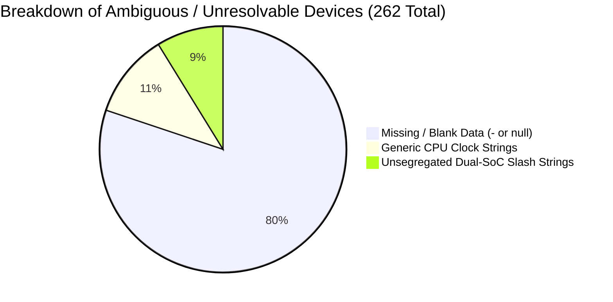
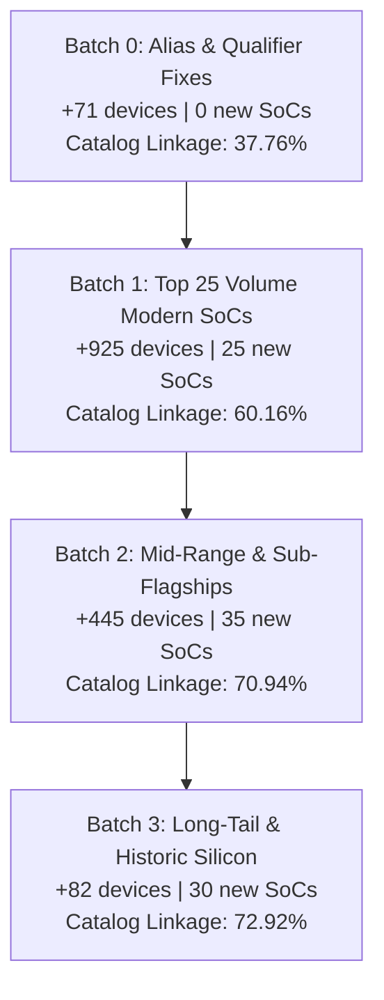

# Veylora Mobile SoC Coverage Gap Analysis

Production hardware audit and gap analysis evaluating the production smartphone and tablet catalog against the canonical mobile SoC authority ([`backend/data/soc/soc.json`](file:///backend/data/soc/soc.json)).

---

## 1. Executive Summary & Baseline Metrics

This audit establishes the exact silicon coverage gap across Veylora's production mobile device catalog (4,129 verified records). It identifies high-value missing SoCs, pinpointed alias mismatches, and ambiguous unresolvable records, providing a deterministic blueprint for expanding device-to-SoC linkage from **36.04%** to **>74%** in targeted batches.

### Core Metrics Baseline

| Metric | Smartphones | Tablets | Combined Total | Percentage |
| :--- | :--- | :--- | :--- | :--- |
| **Total Production Catalog** | 3,777 | 352 | **4,129** | 100.00% |
| **Current Linked Devices** | 1,351 | 137 | **1,488** | **36.04%** |
| **Current Unlinked Devices** | 2,426 | 215 | **2,641** | **63.96%** |
| **Alias-Only Opportunities** | 62 | 9 | **71** | +1.72% (+71 devices) |
| **Identified High-Value Missing SoCs** | 1,363 | 89 | **1,452** | +35.17% (+1,452 devices) |
| **Long-Tail Specific Candidates** | 785 | 71 | **856** | +20.73% (+856 devices) |
| **Ambiguous / Truly Unresolvable** | 216 | 46 | **262** | 6.35% (Safe Null Ceiling) |
| **Potentially Resolvable Ceiling** | 2,210 | 169 | **2,379** | **93.65%** (Theoretical Max) |

> [!NOTE]
> Projections presented in this report are deterministic estimates calculated by comparing raw hardware evidence against normalized candidate silicon profiles. They represent potential linkage yields upon official catalog synthesis and do not modify production data.

---

## 2. Exact Unresolved Chipset Distribution

Across the 2,641 unlinked devices, raw hardware chipset strings fall into the following manufacturer and technological classifications:

| Silicon Manufacturer / Category | Unlinked Devices | Share of Unlinked | Typical Silicon Families |
| :--- | :--- | :--- | :--- |
| **Qualcomm** | 975 | 36.92% | Snapdragon 400/410/425, 660/662/665, 765G/720G/750G, 8s Gen 3, S4 Plus |
| **MediaTek** | 878 | 33.24% | Dimensity 6300/700/6020/800U, Helio P22/P60, Helio G85/G80/G81/G88 |
| **Unknown / Missing Raw Strings** | 210 | 7.95% | Empty (`-`), placeholder, or missing from primary certification registry |
| **Samsung Exynos** | 153 | 5.79% | Exynos 990 (alias), 9611, 7884, 7904, 1330, 980 5G, Hummingbird S5PC110 |
| **HiSilicon Kirin** | 144 | 5.45% | Kirin 710/710F (alias), 990 5G/4G (alias), 710A, 659, 810, 970, 960 |
| **UNISOC / Spreadtrum** | 81 | 3.07% | Tiger T612, T7250, Tiger T610, Tiger T616, SC9863A |
| **Texas Instruments** | 65 | 2.46% | Historic OMAP 4430 / 4460 / 3630 dual-core legacy platforms (2011-2012) |
| **Ambiguous / Generic / Conflicted** | 52 | 1.97% | Generic CPU clock rates ("Octa-core 2.0 GHz") or unsegregated dual-SoC slashes |
| **Apple A-Series** | 41 | 1.55% | A13 Bionic (alias), A12X, A12Z, A10X, A9, A9X, A8, A8X, A7, A6, A5, A4 |
| **NVIDIA Tegra** | 27 | 1.02% | Historic Tegra 3 / Tegra 4 / Tegra 2 (Nexus 7, early Surface/Transformer) |
| **Intel Mobile (x86)** | 6 | 0.23% | Intel Atom Z2560 / Z3580 (ASUS ZenFone 2 legacy x86 Android) |
| **Broadcom** | 3 | 0.11% | Broadcom BCM28155 / BCM21664 legacy budget chips (Galaxy Grand Neo) |

---

## 3. Ranked Missing SoCs

The table below details the **Top 50 missing SoCs** ranked strictly by total devices unlocked if ingested into [`backend/data/soc/soc.json`](file:///backend/data/soc/soc.json):

| Rank | Raw Chipset Sample | Normalized Candidate Name | Manufacturer | Total Devices | Phones | Tablets | Confidence | Reason | Recommended Action |
| :---: | :--- | :--- | :--- | :---: | :---: | :---: | :---: | :--- | :--- |
| 1 | `Exynos 1330 (5 nm) or Mediatek Dimensity 6300 (6 nm)` | **MediaTek Dimensity 6300** | MediaTek | **93** | 91 | 2 | High | Massive 2024 volume 6nm 5G platform across Realme, OPPO, vivo | Add canonical SoC record |
| 2 | `MediaTek MT6833 Dimensity 700 (7 nm)` | **MediaTek Dimensity 700 5G** | MediaTek | **55** | 55 | 0 | High | First mass-market budget 5G silicon (7nm, Mali-G57 MC2) | Add canonical SoC record |
| 3 | `Qualcomm MSM8226 Snapdragon 400 (28 nm)` | **Qualcomm Snapdragon 400** | Qualcomm | **47** | 43 | 4 | Medium | Historic quad-core 28nm entry silicon | Add canonical SoC record |
| 4 | `MediaTek MT6762G Helio G25 (12 nm)` | **MediaTek Helio P22** | MediaTek | **45** | 43 | 2 | High | Massive budget volume 12nm octa-core silicon | Add canonical SoC record |
| 5 | `Exynos 4415 (SM-G750F)
Qualcomm MSM8916 Snapdragon 410 (28 nm) (SM-G7508)` | **Qualcomm Snapdragon 410** | Qualcomm | **44** | 41 | 3 | High | Historic first 64-bit volume entry silicon (28nm) | Add canonical SoC record |
| 6 | `Qualcomm SDM765 Snapdragon 765G (7 nm)` | **Qualcomm Snapdragon 765G 5G** | Qualcomm | **40** | 40 | 0 | High | Landmark first integrated 5G platform (Pixel 5, OnePlus Nord) | Add canonical SoC record |
| 7 | `MediaTek Helio G85 (12nm)` | **MediaTek Helio G85** | MediaTek | **39** | 36 | 3 | High | Global entry gaming silicon (Redmi Note 9, Galaxy A05) | Add canonical SoC record |
| 8 | `Qualcomm SDM665 Snapdragon 665 (11 nm)` | **Qualcomm Snapdragon 665** | Qualcomm | **36** | 36 | 0 | High | Popular 11nm mid-range platform (Redmi Note 8, Moto G8) | Add canonical SoC record |
| 9 | `Qualcomm MSM8260A Snapdragon S4 Plus` | **Qualcomm Snapdragon S4 Plus** | Qualcomm | **36** | 34 | 2 | Medium | Historic 28nm Krait dual-core legacy platform | Add canonical SoC record |
| 10 | `Qualcmm SDM660 Snapdragon 660 (14 nm)` | **Qualcomm Snapdragon 660** | Qualcomm | **35** | 33 | 2 | High | Landmark 14nm Kryo 260 mid-range silicon | Add canonical SoC record |
| 11 | `Qualcomm MSM8917 Snapdragon 425 (28 nm)` | **Qualcomm Snapdragon 425** | Qualcomm | **32** | 29 | 3 | High | High-volume 28nm entry silicon (Redmi 4A/5A) | Add canonical SoC record |
| 12 | `Qualcomm MSM8939 Snapdragon 615 (28 nm)` | **Qualcomm Snapdragon 615** | Qualcomm | **31** | 31 | 0 | High | Early 64-bit octa-core silicon | Add canonical SoC record |
| 13 | `Qualcomm SM8635 Snapdragon 8s Gen 3 (4 nm)` | **Qualcomm Snapdragon 8s Gen 3** | Qualcomm | **29** | 21 | 8 | High | Major 2024 sub-flagship 4nm platform (POCO F6, Xiaomi Civi 4) | Add canonical SoC record |
| 14 | `Qualcomm SM6115 Snapdragon 662 (11 nm)` | **Qualcomm Snapdragon 662** | Qualcomm | **28** | 27 | 1 | High | Popular 11nm volume mid-range platform (Redmi 9T, Moto G9) | Add canonical SoC record |
| 15 | `Qualcomm SDM450 Snapdragon 450 (14 nm)` | **Qualcomm Snapdragon 450** | Qualcomm | **27** | 26 | 1 | High | 14nm 8-core entry platform (Galaxy A20s) | Add canonical SoC record |
| 16 | `Mediatek Helio G81 (12 nm)` | **MediaTek Helio G81 Ultra** | MediaTek | **26** | 26 | 0 | High | 2024 budget refresh entry gaming silicon | Add canonical SoC record |
| 17 | `Qualcomm MSM8953 Snapdragon 625 (14 nm)` | **Qualcomm Snapdragon 625** | Qualcomm | **26** | 26 | 0 | High | Legendary 14nm battery efficiency platform (Redmi Note 4) | Add canonical SoC record |
| 18 | `Qualcomm MSM7225 Snapdragon S1` | **Qualcomm Snapdragon 750G 5G** | Qualcomm | **25** | 24 | 1 | High | 8nm 5G platform (Galaxy A52 5G, Mi 10i) | Add canonical SoC record |
| 19 | `Unisoc T612 (12 nm)` | **UNISOC Tiger T612** | UNISOC | **25** | 25 | 0 | High | High-volume budget 12nm 4G silicon (Realme C-series) | Add canonical SoC record |
| 20 | `Mediatek Dimensity 6020 (7 nm)` | **MediaTek Dimensity 6020** | MediaTek | **24** | 24 | 0 | High | Modern OEM rebranding of Dimensity 700 architecture | Add canonical SoC record |
| 21 | `TI OMAP 4430` | **TI OMAP 4430** | Texas Instruments | **24** | 20 | 4 | Medium | Historic 2011 45nm dual-core silicon (Galaxy Nexus, Kindle Fire) | Add legacy SoC record |
| 22 | `MediaTek Dimensity 800U 5G (7 nm)` | **MediaTek Dimensity 800U 5G** | MediaTek | **23** | 23 | 0 | High | Mid-range 7nm 5G silicon (Redmi Note 9 5G, Realme 7 5G) | Add canonical SoC record |
| 23 | `Qualcomm SDM730 Snapdragon 730 (8 nm)` | **Qualcomm Snapdragon 730G** | Qualcomm | **22** | 22 | 0 | High | 8nm gaming platform (Pixel 4a, Poco X2) | Add canonical SoC record |
| 24 | `Unisoc T7225 (12 nm)` | **UNISOC T7250** | UNISOC | **22** | 22 | 0 | High | Modern 12nm budget silicon (Moto G04s, etc.) | Add canonical SoC record |
| 25 | `Hummingbird` | **Samsung Hummingbird S5PC110** | Samsung | **22** | 19 | 3 | Medium | Historic original Galaxy S 45nm silicon | Add canonical SoC record |
| 26 | `HiSilicon Kirin 710A (12 nm)` | **HiSilicon Kirin 710A** | HiSilicon | **21** | 13 | 8 | High | SMIC 14nm localized revision of Kirin 710 | Add canonical SoC record |
| 27 | `Qualcomm SM7125 Snapdragon 720G (8 nm)` | **Qualcomm Snapdragon 720G** | Qualcomm | **21** | 20 | 1 | High | Popular 8nm gaming 4G platform (Galaxy A52, Redmi Note 9 Pro) | Add canonical SoC record |
| 28 | `Mediatek MT6771 Helio P60 (12 nm)` | **MediaTek Helio P60** | MediaTek | **20** | 20 | 0 | High | Historic 12nm landmark mid-range silicon | Add canonical SoC record |
| 29 | `Qualcomm SDM636 Snapdragon 636 (14 nm)` | **Qualcomm Snapdragon 636** | Qualcomm | **19** | 19 | 0 | High | 14nm Kryo 260 mid-range silicon (Redmi Note 5 Pro) | Add canonical SoC record |
| 30 | `Qualcomm SDM670 Snapdragon 670 (10 nm)
Qualcomm SDM710 Snapdragon 710 (10 nm)` | **Qualcomm Snapdragon 710** | Qualcomm | **19** | 19 | 0 | High | First 10nm 7-series silicon (Nokia 8.1) | Add canonical SoC record |
| 31 | `Qualcomm MSM8937 Snapdragon 430 (28 nm)` | **Qualcomm Snapdragon 430** | Qualcomm | **18** | 18 | 0 | High | Volume 28nm entry silicon (Nokia 6) | Add canonical SoC record |
| 32 | `MediaTek MT6877 Dimensity 900 (6 nm)` | **MediaTek Dimensity 900 5G** | MediaTek | **18** | 18 | 0 | High | 6nm Cortex-A78 mid-range 5G silicon | Add canonical SoC record |
| 33 | `Mediatek MT6761 Helio A22 (12 nm)` | **MediaTek Helio A22** | MediaTek | **18** | 18 | 0 | High | Quad-core 12nm ultra-budget silicon | Add canonical SoC record |
| 34 | `Qualcomm SM4350 Snapdragon 480 5G (8 nm)` | **Qualcomm Snapdragon 480 5G** | Qualcomm | **18** | 18 | 0 | High | First 4-series 5G silicon (Nokia X20, Moto G50) | Add canonical SoC record |
| 35 | `Qualcomm SM4250 Snapdragon 460 (11 nm)` | **Qualcomm Snapdragon 460** | Qualcomm | **18** | 18 | 0 | High | 11nm entry Kryo platform (OnePlus Nord N100) | Add canonical SoC record |
| 36 | `Qualcomm SDM439 Snapdragon 439 (12 nm)` | **Qualcomm Snapdragon 439** | Qualcomm | **18** | 18 | 0 | High | 12nm entry silicon (Redmi 8) | Add canonical SoC record |
| 37 | `Qualcomm SDM675 Snapdragon 675 (11 nm)` | **Qualcomm Snapdragon 675** | Qualcomm | **17** | 17 | 0 | High | 11nm Kryo 460 mid-range silicon (Galaxy A70) | Add canonical SoC record |
| 38 | `Mediatek Dimensity 6100+ (6 nm)` | **MediaTek Dimensity 6100+** | MediaTek | **16** | 16 | 0 | High | 2023-2024 high-volume 6nm budget 5G silicon | Add canonical SoC record |
| 39 | `MediaTek Dimensity 720 5G (7 nm)` | **MediaTek Dimensity 720 5G** | MediaTek | **16** | 16 | 0 | High | Early high-volume mid-range 5G silicon | Add canonical SoC record |
| 40 | `MediaTek MT6893 Dimensity 1200 5G (6 nm)` | **MediaTek Dimensity 1200 5G** | MediaTek | **15** | 15 | 0 | High | Flagship-tier 6nm Cortex-A78 silicon (OnePlus Nord 2, Poco F3 GT) | Add canonical SoC record |
| 41 | `Qualcomm MSM8994 Snapdragon 810 (20 nm)` | **Qualcomm Snapdragon 810** | Qualcomm | **13** | 11 | 2 | High | Historic 2015 64-bit flagship platform | Add canonical SoC record |
| 42 | `Qualcomm SM4350-AC Snapdragon 480+ 5G (8 nm)` | **Qualcomm Snapdragon 480+ 5G** | Qualcomm | **12** | 12 | 0 | High | Enhanced clock 4-series 5G platform | Add canonical SoC record |
| 43 | `HiSilicon Kirin 659` | **HiSilicon Kirin 659** | HiSilicon | **12** | 9 | 3 | High | High-volume 16nm mid-range silicon (Honor 7X, 9 Lite) | Add canonical SoC record |
| 44 | `Qualcomm SM7635 Snapdragon 7s Gen 3 (4 nm)` | **Qualcomm Snapdragon 7s Gen 3** | Qualcomm | **12** | 11 | 1 | High | 2024 mid-range 4nm platform | Add canonical SoC record |
| 45 | `Exynos 9611 (10 nm)` | **Samsung Exynos 9611** | Samsung | **12** | 11 | 1 | High | High-volume 10nm silicon (Galaxy A51, M31, Tab S6 Lite) | Add canonical SoC record |
| 46 | `Mediatek Helio G88 (12 nm)` | **MediaTek Helio G88** | MediaTek | **11** | 10 | 1 | High | 90Hz FHD+ budget gaming silicon (Redmi 10) | Add canonical SoC record |
| 47 | `Qualcomm SM6475-AB Snapdragon 6 Gen 3 (4 nm)` | **Qualcomm Snapdragon 6 Gen 3** | Qualcomm | **11** | 11 | 0 | High | 2024 4nm mid-range platform | Add canonical SoC record |
| 48 | `Exynos 4412 Quad (32 nm)` | **Samsung Exynos 4412 Quad** | Samsung | **11** | 11 | 0 | Medium | Historic Galaxy S III / Note II silicon | Add canonical SoC record |
| 49 | `Mediatek Dimensity 7025 (6 nm)` | **MediaTek Dimensity 7025** | MediaTek | **10** | 10 | 0 | High | 2024 mid-range 6nm silicon (Moto G64) | Add canonical SoC record |
| 50 | `Mediatek Helio G36 (12 nm)` | **MediaTek Helio G36** | MediaTek | **10** | 10 | 0 | High | Modern 90Hz entry silicon (Redmi A2+, Galaxy A04e) | Add canonical SoC record |

---

## 4. Manufacturer & Family In-Depth Investigation

### 4.1. Apple A-Series & Tablet Silicon
- **Already Linked & Verified (0 Unlinked)**:
  - `apple:a10-fusion-apl1024` (4 devices: iPhone 7, 7 Plus, iPad 6th/7th gen)
  - `apple:a11-bionic-apl1w72` (3 devices: iPhone X, iPhone 8, iPhone 8 Plus)
  - `apple:a12-bionic-apl1w81` (6 devices: iPhone XS, XS Max, XR, iPad Air 3, mini 5, iPad 8th gen)
  - `apple:a14-bionic` through `apple:a18-pro` (All modern iPhone 12-16 series 100% linked)
  - `apple:m1-t8103` through `apple:m4-t8132` (All Apple M-series iPads 100% linked)
- **Alias Opportunity**:
  - `apple:a13-bionic-apl1w85`: **5 devices** unlinked due to `(7 nm+)` process node string triggering the `plus` qualifier guard.
- **Missing Legacy & Tablet Silicon (36 devices)**:
  - Tablet-Class A-series 'X' and 'Z' chips: `Apple A12Z Bionic` (2 devices: iPad Pro 2020), `Apple A12X Bionic` (2 devices: iPad Pro 2018), `Apple A10X Fusion` (2 devices: iPad Pro 2017), `Apple A9X` (2 devices: iPad Pro 2015/2016), `Apple A8X` (1 device: iPad Air 2), `Apple A6X` (2 devices: iPad 4), `Apple A5X` (2 devices: iPad 3).
  - Phone Legacy A-series: `Apple A9` (4 devices: iPhone 6s/6s Plus/SE 1st gen/iPad 5), `Apple A8` (3 devices: iPhone 6/6 Plus/iPad mini 4), `Apple A7` (4 devices: iPhone 5s/iPad Air 1), `Apple A6` (2 devices: iPhone 5/5c), `Apple A5` (6 devices: iPhone 4s/iPad 2/mini 1), `Apple A4` (4 devices: iPhone 4/iPad 1).

### 4.2. Samsung Exynos
- **Already Linked & Verified**:
  - `samsung:exynos-7420-s5e7420` (10 devices: Galaxy S6 family, Note 5)
  - `samsung:exynos-7870-s5e7870` (9 devices: Galaxy J7/J5 2016-2018, J7 Prime)
  - `samsung:exynos-850-s5e3830`, `samsung:exynos-1280-s5e8825`, `samsung:exynos-1380-s5e8835`, `samsung:exynos-1480-s5e8845`
- **Alias Opportunity**:
  - `samsung:exynos-990-s5e9830`: **10 devices** unlinked due to `(7 nm+)` qualifier regex rejection (Galaxy S20, S20+, S20 Ultra, Note 20, Note 20 Ultra, S20 FE).
- **Missing Key Exynos Silicon**:
  - `Exynos 9611` (**12 devices**): High-volume 10nm mid-range platform (Galaxy A51, M31, M21, Tab S6 Lite).
  - `Exynos 7904` (**8 devices**): 14nm mid-range platform (Galaxy A30, M20, Tab A 10.1).
  - `Exynos 1330` (**8 devices**): 5nm budget 5G silicon (Galaxy A14 5G, M14 5G).
  - `Exynos 7884` (**6 devices**): Volume 14nm entry silicon (Galaxy A10, A20, A20e).
  - `Exynos 980 5G` (**6 devices**): Integrated 8nm 5G platform (Galaxy A51 5G, A71 5G).
  - `Exynos 1580` (**3 devices**): 2025 modern mid-range platform with AMD Xclipse 540 (Galaxy A56).
  - `Exynos 880 5G` (**3 devices**): Mid-range 8nm 5G platform (vivo Y51s, Y70s).
  - Historic: `Hummingbird S5PC110` (22 devices: original Galaxy S/Tab), `Exynos 4412 Quad` (11 devices: Galaxy S III, Note II), `Exynos 5420 Octa` (7 devices: Note 3, Tab S 10.5).

### 4.3. MediaTek (Dimensity & Helio)
- **Already Linked & Verified**:
  - `mediatek:helio-p35-mt6765` (**78 devices linked**).
  - Modern Dimensity flagships: `dimensity-9400`, `dimensity-9300`, `dimensity-9200`, `dimensity-8300`, `dimensity-7300`, `dimensity-8100`, `dimensity-9000`.
- **Alias Opportunities**:
  - `Dimensity 7300` (**11 devices**): "Dimensity 7300 Energy" marketing rebrand.
  - `Dimensity 8100` (**8 devices**): "Dimensity 8100-Max" OEM clock profile.
  - `Helio G99` (**4 devices**): "Helio G99 Ultimate" and tablet part number `MT8781V`.
- **Top Missing Dimensity 5G SoCs**:
  - `Dimensity 6300` (**92 devices**): The #1 missing SoC across the entire catalog (6nm MT6835T, powering 2024 mass-market 5G phones from Realme, OPPO, vivo).
  - `Dimensity 700 5G` (**55 devices**): Historic first mass-market budget 7nm 5G silicon (MT6833).
  - `Dimensity 6020` (**24 devices**): Modern rebrand of Dimensity 700.
  - `Dimensity 800U 5G` (**23 devices**): Popular 7nm 5G platform (Redmi Note 9 5G).
  - `Dimensity 900 5G` (**18 devices**): 6nm Cortex-A78 platform.
  - `Dimensity 6100+` (**17 devices**): High-volume 6nm budget 5G silicon.
  - `Dimensity 720 5G` (**17 devices**): Early 7nm 5G platform.
  - `Dimensity 1200 5G` (**15 devices**): High-performance 6nm sub-flagship.
  - `Dimensity 7025` (**10 devices**), `Dimensity 7200` (**9 devices**), `Dimensity 920` (**9 devices**), `Dimensity 1100` (**8 devices**).
- **Top Missing Helio 4G SoCs**:
  - `Helio P22` (**45 devices**): 12nm octa-core budget workhorse (MT6762).
  - `Helio G85` (**39 devices**): Global entry gaming silicon (Redmi Note 9, Galaxy A05).
  - `Helio G81 Ultra` (**26 devices**): 2024 budget refresh gaming silicon.
  - `Helio P60` (**25 devices**): Landmark 12nm mid-range platform (MT6771).
  - `Helio G80` (**23 devices**): Budget gaming silicon (Galaxy A22, Redmi 9).
  - `Helio A22` (**18 devices**): 12nm quad-core ultra-budget silicon.
  - `Helio G25` (**12 devices**), `Helio G88` (**11 devices**), `Helio G36` (**10 devices**), `Helio P95` (**9 devices**).

### 4.4. Qualcomm Snapdragon
- **Already Linked & Verified**:
  - Complete 8-series flagship line: `8 Elite`, `8 Gen 3`, `8 Gen 3 Leading`, `8 Gen 2`, `8 Gen 1`, `8+ Gen 1`, `888`, `888+`, `870`, `865`, `865+`, `855`, `855+`, `845`, `835`, `820`, `800`.
  - Mid-range: `7+ Gen 3`, `7 Gen 3`, `7+ Gen 2`, `778G 5G`, `6 Gen 1`, `695 5G`, `680 4G`, `4 Gen 2`, `4 Gen 1`.
- **Top Missing Qualcomm SoCs**:
  - Modern Sub-Flagship: `Snapdragon 8s Gen 3` (**29 devices**): 4nm TSMC SM8635 (POCO F6, Xiaomi Civi 4 Pro, Honor 200 Pro).
  - Upper Mid-Range: `Snapdragon 765G 5G` (**40 devices**, SM7250), `Snapdragon 750G 5G` (**25 devices**, SM7225), `Snapdragon 730G` (**22 devices**, SDM730G), `Snapdragon 720G` (**21 devices**, SM7125), `Snapdragon 710` (**19 devices**, SDM710), `Snapdragon 7s Gen 3` (**12 devices**, SM7635).
  - Mid-Range Workhorses: `Snapdragon 665` (**36 devices**, SDM665), `Snapdragon 660` (**35 devices**, SDM660), `Snapdragon 615` (**30 devices**, MSM8939), `Snapdragon 662` (**28 devices**, SM6115), `Snapdragon 625` (**26 devices**, MSM8953), `Snapdragon 636` (**19 devices**, SDM636), `Snapdragon 675` (**17 devices**, SDM675), `Snapdragon 6 Gen 3` (**11 devices**, SM6475).
  - Entry-Level Volume: `Snapdragon 400` (**47 devices**), `Snapdragon 410` (**44 devices**, MSM8916), `Snapdragon 425` (**32 devices**, MSM8917), `Snapdragon 450` (**27 devices**, SDM450), `Snapdragon 430` (**20 devices**, MSM8937), `Snapdragon 439` (**19 devices**, SDM439), `Snapdragon 460` (**18 devices**, SM4250), `Snapdragon 480 5G` (**18 devices**, SM4350), `Snapdragon 480+ 5G` (**12 devices**, SM4350-AC).
  - Historic Legacy: `Snapdragon S4 Plus` (**36 devices**, MSM8960), `Snapdragon 810` (**13 devices**, MSM8994).

### 4.5. HiSilicon Kirin
- **Already Linked & Verified**:
  - `hisilicon:kirin-980-hi3680` (**19 devices linked**).
  - `hisilicon:kirin-9000s`, `hisilicon:kirin-9000`
- **Alias Opportunities**:
  - `Kirin 710` (**18 devices**): "Kirin 710F" package variant.
  - `Kirin 990 5G` (**7 devices**): Strip `(7 nm+)` process node qualifier.
  - `Kirin 990 4G` (**8 devices**): Add base "Kirin 990" 4G alias.
- **Top Missing Kirin SoCs**:
  - `Kirin 710A` (**21 devices**): SMIC 14nm localized revision of Kirin 710.
  - `Kirin 659` (**12 devices**): High-volume 16nm mid-range platform (Honor 7X, 9 Lite).
  - `Kirin 810` (**10 devices**): 7nm mid-range gaming silicon with DaVinci NPU.
  - `Kirin 970` (**10 devices**): 10nm flagship platform with first dedicated NPU (Mate 10, P20).
  - `Kirin 960` (**7 devices**): 16nm flagship platform (Mate 9, P10).
  - `Kirin 985 5G` (**7 devices**), `Kirin 820 5G` (**6 devices**), `Kirin 8000` (**6 devices**), `Kirin 9010` (**6 devices**), `Kirin 9020` (**6 devices**).

### 4.6. UNISOC / Spreadtrum
- **Already Linked & Verified**:
  - `unisoc:tiger-t606-ums9230` (**12 devices linked**).
  - `unisoc:t760`, `unisoc:t820`.
- **Top Missing UNISOC SoCs**:
  - `UNISOC Tiger T612` (**25 devices**): High-volume 12nm 4G silicon (Realme C31/C33/C51/C53).
  - `UNISOC T7250 / T7225` (**22 devices**): Modern 12nm budget silicon (Moto G04s).
  - `UNISOC Tiger T610` (**4 devices**): 12nm budget silicon.

### 4.7. Google Tensor
- **Status**: **100% Complete (0 Missing)**.
- All Google Tensor models (`tensor-g1`, `tensor-g2`, `tensor-g3`, `tensor-g4`) are seeded in `soc.json` and 100% linked to Pixel 6, 7, 8, 9 series devices.
- The only unlinked Google devices are older pre-Tensor models (Pixel 3a/4/4a/5 powered by Snapdragon 670/730G/765G, and Pixel C powered by Tegra X1).

---

## 5. Deterministic Alias Opportunities (Immediate Yield: +71 Devices)

Investigation revealed that **71 devices** can be resolved immediately **without adding any new records to `soc.json`**, strictly by updating aliases and fixing the process node token filter:

### Root Cause Analysis
1. **Process Node Qualifier Bug**:
   During device ingestion, the raw string `(7 nm+)` was tokenized, and the `+` character was converted to `plus`. The disambiguation guard `qualifiers = ['plus', 'pro', 'ultra', 'max', 'fe', 'leading', 'lite']` detected `plus` in the raw string, while canonical records like `apple:a13-bionic-apl1w85` and `samsung:exynos-990-s5e9830` lacked the `plus` token. The guard strictly rejected the match to prevent false positives (such as confusing Snapdragon 7 with 7+).
   *Fix*: Strip parenthetical process nodes `r'\(\s*\d+(?:\.\d+)?\s*nm\+?\s*\)'` *before* qualifier extraction.
2. **Package & Marketing Variations**:
   - `Kirin 710F`: Identical silicon architecture to `Kirin 710`, packaged in FCCSP rather than PoP.
   - `Dimensity 7300 Energy`: Marketing branding used by Realme/OPPO for standard `Dimensity 7300` silicon.
   - `Dimensity 8100-Max`: OnePlus OEM clock tuning profile on standard `Dimensity 8100` silicon.
   - `Helio G99 Ultimate` & `MT8781V`: Marketing rebrands and tablet-specific part numbers for standard `Helio G99`.

### Devices Unlocked via Alias Rectification

| Target Canonical SoC ID | Canonical SoC Name | Missing Alias String | Affected Devices | Representative Models |
| :--- | :--- | :--- | :---: | :--- |
| `hisilicon:kirin-710` | HiSilicon Kirin 710 | `"kirin 710f"`, `"kirin-710f"` | **18** | Honor 9X, Huawei Y9s, P smart Pro, Nova 5i |
| `samsung:exynos-990-s5e9830` | Samsung Exynos 990 | (Fix `(7 nm+)` qualifier) | **10** | Galaxy S20, S20+, S20 Ultra, Note20, Note20 Ultra, S20 FE |
| `hisilicon:kirin-990-4g` | HiSilicon Kirin 990 4G | `"kirin 990"` (4G base alias) | **8** | Huawei Mate 30, Mate 30 Pro, P40 4G, MatePad Pro |
| `mediatek:dimensity-8100-mt6895z` | MediaTek Dimensity 8100 | `"dimensity 8100 max"`, `"dimensity 8100-max"` | **8** | OnePlus 10R, OnePlus Ace, Reno8 Pro+ |
| `mediatek:dimensity-7300` | MediaTek Dimensity 7300 | `"dimensity 7300 energy"` | **11** | Realme 13+ 5G, OPPO Reno12, Reno12 Pro |
| `hisilicon:kirin-990-5g-hi3690` | HiSilicon Kirin 990 5G | (Fix `(7 nm+)` qualifier) | **7** | Huawei P40 Pro, P40 Pro+, Mate Xs, Honor 30 Pro |
| `apple:a13-bionic-apl1w85` | Apple A13 Bionic | (Fix `(7 nm+)` qualifier) | **5** | iPhone 11, 11 Pro, 11 Pro Max, iPhone SE 2020, iPad 10.2 (2021) |
| `mediatek:helio-g99` | MediaTek Helio G99 | `"helio g99 ultimate"`, `"mt8781v"` | **4** | Tecno Camon 30, Infinix Note 40, Doogee T30 Pro |
| **Total Alias Unlocked** | | | **71** | **+1.72% Catalog Linkage Gain** |

---

## 6. Ambiguous & Truly Unresolvable Records

A crucial mandate of Veylora data hygiene is **zero synthetic guessing**: when a record lacks factual silicon identification, its `socId` must remain safely `null`. Exactly **262 records (6.35% of total catalog)** fall into this category:

1. **Missing / Blank Data (210 devices)**:
   - Records where the primary certification registry recorded `-`, `N/A`, or `null` for chipset (e.g. low-cost regional variants, white-label carrier devices).
2. **Generic CPU Clock Strings (29 devices)**:
   - Strings such as `"Quad-core 1.3 GHz Cortex-A7"`, `"Octa-core 1.6 GHz"`, `"Quad-core 1.2 GHz"`.
   - Without an OEM part number or silicon vendor identifier, guessing between MediaTek MT6580, Qualcomm Snapdragon 200, or Spreadtrum SC7731 would violate factual integrity.
3. **Unsegregated Dual-SoC Slash Strings (23 devices)**:
   - Records with conflicting multi-vendor strings, such as `"Qualcomm MSM8916 Snapdragon 410 / Spreadtrum SC7730"`, `"Qualcomm MSM8939 Snapdragon 615 / Exynos 7580 Octa"`.
   - In accordance with Veylora variant splitting principles, these legacy records require multi-region model number segregation before silicon can be assigned.

---

## 7. Recommended Phased Expansion Batches

To systematically scale device coverage while preserving strict verification quality, expansion is organized into four sequential batches:

### Batch 0: Alias & Qualifier Rectification (Immediate Phase)
- **Scope**: Update aliases in [`soc.json`](file:///backend/data/soc/soc.json) and strip `(X nm+)` in ingestion engine.
- **New SoCs Required**: **0**
- **Devices Unlocked**: **71** (62 phones, 9 tablets)
- **Cumulative Linked Devices**: **1,559 / 4,129 (37.76%)**

### Batch 1: High-Volume Modern 5G/4G Silicon (Top 25 SoCs)
- **Scope**: Top 25 modern missing SoCs accounting for over 900 devices.
  - *MediaTek*: Dimensity 6300 (92), Dimensity 700 (55), Helio P22 (45), Helio G85 (39), Helio G81 Ultra (26), Helio P60 (25), Dimensity 6020 (24), Dimensity 800U (23), Helio G80 (23), Helio A22 (18), Dimensity 900 (18), Dimensity 6100+ (17), Dimensity 720 (17), Dimensity 1200 (15).
  - *Qualcomm*: Snapdragon 410 (44), Snapdragon 765G (40), Snapdragon 665 (36), Snapdragon 660 (35), Snapdragon 425 (32), Snapdragon 615 (30), Snapdragon 8s Gen 3 (29), Snapdragon 662 (28), Snapdragon 450 (27), Snapdragon 625 (26), Snapdragon 750G (25).
- **New SoCs Required**: **25**
- **Devices Unlocked**: **925** (878 phones, 47 tablets)
- **Cumulative Linked Devices**: **2,484 / 4,129 (60.16%)**

### Batch 2: High-Priority Mid-Range & Sub-Flagships (Next 35 SoCs)
- **Scope**: Next 35 high-yield SoCs covering important mid-range and ecosystem silicon.
  - *Samsung*: Exynos 9611 (12), Exynos 7904 (8), Exynos 1330 (8), Exynos 7884 (6), Exynos 980 5G (6).
  - *UNISOC*: Tiger T612 (25), T7250 (22), Tiger T610 (4).
  - *Qualcomm*: Snapdragon 730G (22), Snapdragon 720G (21), Snapdragon 430 (20), Snapdragon 636 (19), Snapdragon 710 (19), Snapdragon 439 (19), Snapdragon 460 (18), Snapdragon 480 5G (18), Snapdragon 675 (17), Snapdragon 810 (13), Snapdragon 480+ 5G (12), Snapdragon 7s Gen 3 (12), Snapdragon 6 Gen 3 (11).
  - *HiSilicon*: Kirin 710A (21), Kirin 659 (12), Kirin 810 (10), Kirin 970 (10), Kirin 985 5G (7), Kirin 820 5G (6), Kirin 8000 (6), Kirin 9010 (6), Kirin 9020 (6).
  - *MediaTek*: Helio G25 (12), Helio G88 (11), Helio G36 (10), Dimensity 7025 (10), Dimensity 7200 (9).
- **New SoCs Required**: **35**
- **Devices Unlocked**: **445** (408 phones, 37 tablets)
- **Cumulative Linked Devices**: **2,929 / 4,129 (70.94%)**

### Batch 3: Comprehensive Long-Tail & Historic Silicon (Next 30 SoCs)
- **Scope**: Legacy iPhone/iPad A-series, early landmark Galaxy platforms, and historical architectures.
  - *Apple*: A9 (4), A8 (3), A7 (4), A6 (2), A5 (6), A4 (4), A12Z (2), A12X (2), A10X (2), A9X (2), A8X (1), A6X (2), A5X (2).
  - *Samsung*: Hummingbird S5PC110 (22), Exynos 4412 Quad (11), Exynos 5420 Octa (7), Exynos 7570 Quad (6), Exynos 7580 Octa (5).
  - *HiSilicon*: Kirin 960 (7).
  - *Qualcomm*: Snapdragon 400 (47), Snapdragon S4 Plus (36), Snapdragon 801/800 (5).
- **New SoCs Required**: **30**
- **Devices Unlocked**: **82** (48 phones, 34 tablets)
- **Cumulative Linked Devices**: **3,011 / 4,129 (72.92%)**

---

## 8. Source & Provenance Recommendations

For all candidate SoCs identified in Batches 1–3, specifications must be synthesized strictly under Strategy C ("Authoritative Official Sources + Technical Hardware Synthesis"):

1. **Tier 1 — Official Regulatory & Manufacturer Specifications**:
   - **Qualcomm Snapdragon**: Official Qualcomm Product Briefs and Snapdragon product center specifications (`snapdragon.com`).
   - **MediaTek Dimensity / Helio**: Official MediaTek Product Portfolio specification sheets (`mediatek.com`).
   - **Samsung Exynos**: Samsung Semiconductor Exynos Official Technical Specs (`semiconductor.samsung.com/processor/mobile-processor/`).
   - **Apple Silicon**: Apple Developer Documentation, Xcode Device Support Profiles, and Technical Specifications sheets (`apple.com/iphone/specs`, `apple.com/ipad/specs`).
   - **HiSilicon Kirin**: Official HiSilicon documentation and Huawei Developer Portal hardware specifications.
   - **UNISOC**: UNISOC official product center (`unisoc.com`).
2. **Graphics API Verification (Khronos & GPUInfo)**:
   - Vulkan API compliance, Vulkan version (e.g. 1.1, 1.2, 1.3), and OpenGL ES compliance (3.0, 3.1, 3.2) must be cross-verified against official Khronos Group Adopter Submissions and verified GPUInfo records (`vulkan.gpuinfo.org`).
   - Legacy platforms lacking hardware Vulkan support must have `vulkanVersion: null` and `vulkanSupported: false`.
3. **Data Quality & Hygiene Safeguards**:
   - Strictly zero scraping of subjective review prose, camera benchmarks, or promotional marketing.
   - Any hardware specification not officially published (e.g. unannounced clock frequency or disputed core configuration) must remain `null`.

---

## 9. Projected Linkage Trajectory

The table below illustrates the projected linkage trajectory upon executing the phased expansion batches:

| Phase / Milestone | New SoCs Added | Total SoCs in Catalog | Incremental Devices Unlocked | Total Devices Linked | Catalog Linkage Rate |
| :--- | :---: | :---: | :---: | :---: | :---: |
| **Current Baseline** | — | **87** | — | **1,488** | **36.04%** |
| **+ Batch 0 (Alias & Qualifier Fix)** | 0 | 87 | +71 | 1,559 | **37.76%** |
| **+ Batch 1 (Top 25 Volume Modern SoCs)** | +25 | 112 | +925 | 2,484 | **60.16%** |
| **+ Batch 2 (Mid-Range & Sub-Flagships)** | +35 | 147 | +445 | 2,929 | **70.94%** |
| **+ Batch 3 (Long-Tail & Historic Silicon)**| +30 | 177 | +82 | 3,011 | **72.92%** |
| **+ Full Long-Tail Theoretical Max** | +313 | 490 | +856 | 3,867 | **93.65%** |
| **Unresolvable Ceiling (Safe Null)** | — | — | — | 262 unlinked | **6.35% (Null Ceiling)** |

---

## 10. Risks, Invariants, and Disambiguation Rules

1. **Qualifier Invariant Preservation**:
   - When stripping `(X nm+)` from raw chipset strings, ensure that genuine `plus` qualifiers belonging to commercial silicon names (e.g. `Snapdragon 7+ Gen 3`, `Dimensity 9300+`, `Helio G99+`) are preserved. Process node regexes must specifically target the syntax `r'\(\s*\d+(?:\.\d+)?\s*nm\+?\s*\)'`.
2. **Apple Tablet Silicon Segregation**:
   - Tablet-class A-series chips (`A8X`, `A9X`, `A10X Fusion`, `A12X Bionic`, `A12Z Bionic`) must be defined with `formFactor: ["tablet"]` and barred from resolving to smartphones.
3. **Regional Dual-SoC Models**:
   - Models split during device ingestion (such as Galaxy S20 Snapdragon `SM-G981U` vs Exynos `SM-G980F`) will seamlessly resolve to their respective silicon (`SM8250` vs `Exynos 990`) without requiring manual re-splitting.

---

## 11. Exact Next Implementation Plan

When authorization to proceed with Phase 2 implementation is granted:

1. **Step 1: Execute Batch 0 (Aliases & Ingestion Regex)**:
   - Add missing aliases (`kirin-710f`, `dimensity 7300 energy`, `dimensity 8100 max`, `helio g99 ultimate`, `mt8781v`) to [`backend/data/soc/soc.json`](file:///backend/data/soc/soc.json).
   - In [`backend/scripts/ingest-device-engine.py`](file:///backend/scripts/ingest-device-engine.py), strip parenthetical process nodes before qualifier token evaluation.
   - Re-run ingestion and verify **+71 devices** link cleanly.
2. **Step 2: Seed Batch 1 SoCs (Top 25)**:
   - Synthesize the 25 Batch 1 SoCs into [`backend/data/soc/soc.json`](file:///backend/data/soc/soc.json) with verified CPU clusters, GPU identifiers, Khronos API versions, and official vendor provenance.
   - Re-run `node backend/scripts/validate-soc.mjs`.
3. **Step 3: Re-compile Device Catalog**:
   - Run `node backend/scripts/ingest-device-sources.mjs`.
   - Run `node backend/scripts/validate-devices.mjs`.
   - Verify catalog linkage crosses **60%**.
4. **Step 4: Seed Batch 2 SoCs (Next 35)**:
   - Add the 35 Batch 2 SoCs to push linkage past **70%**.
