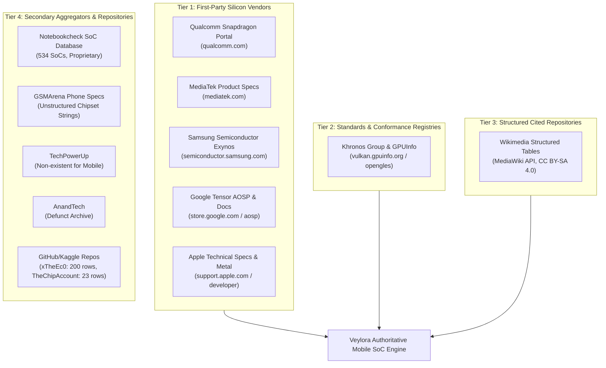
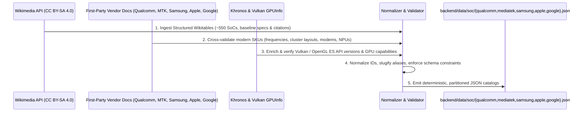

# Mobile SoC Dataset Authoritative Source Discovery & Comparative Audit

**Evaluation Target:** Authoritative and Reproducible Sources for Mobile System-on-Chips (SoCs)  
**Target Coverage:** Qualcomm Snapdragon, MediaTek Dimensity/Helio, Samsung Exynos, Google Tensor, Apple A-Series, Apple M-Series (mobile/tablet context)  
**Baseline Dataset:** Veylora Hardware Backend (Currently 0 SoC records; Greenfield mobile domain)  
**Audit Date:** September 2026  
**Auditor:** Antigravity AI (on behalf of Veylora Engineering)  
**Recommended Strategy:** **C) BUILD FROM AUTHORITATIVE OFFICIAL SOURCES** (Structured Multi-Tier Vendor Synthesis with Khronos Conformance & Wikimedia Spine)

---

## 1. Executive Summary

This audit performs an exhaustive, read-only investigation into candidate datasets, public repositories, first-party semiconductor documentation, and technical registries to establish an authoritative hardware data foundation for mobile System-on-Chips (SoCs) within Veylora.

### Key Audit Findings:
1. **Existing Veylora Baseline is Greenfield (0 Records):**
   A complete scan of the Veylora monorepo confirms that while comprehensive x86 desktop/laptop CPU (`backend/data/cpu/`, 9,837 normalized records) and discrete/integrated GPU (`backend/data/gpu/`, 3,450+ records) backends exist, Veylora currently contains **zero mobile SoC datasets, zero mobile chipset services, zero SoC TypeScript interfaces, and zero mobile compatibility logic**.
2. **No Single Off-The-Shelf Licensed Dataset Exists for Mobile SoCs:**
   Unlike desktop CPUs (where `toUpperCase78/intel-processors` compiled Intel ARK under GPL-3.0) or discrete GPUs (where open GPU databases exist), no third-party open-source repository or public API currently provides a complete, actively maintained, licensed database of all major mobile SoCs. Open-source GitHub projects (such as `xTheEc0/Android-Device-Hardware-Specs-Database` with 200 records or `sasrath/TheChipAccount` with 23 records) are severely incomplete, outdated, or strictly focused on narrow board mappings.
3. **TechPowerUp Does Not Maintain a Smartphone SoC Database:**
   Investigation confirmed that TechPowerUp's CPU database is strictly restricted to x86 processors (Intel, AMD, VIA), and its GPU database covers discrete and desktop GPUs. ARM smartphone processors are only covered ad-hoc in news articles.
4. **AnandTech is a Defunct Static Archive:**
   AnandTech ceased editorial publication on August 30, 2024. While historical microarchitecture analyses remain high-quality reference material, the site has no API and will never index modern silicon (Snapdragon 8 Elite, Dimensity 9400, Tensor G4/G5, Apple A18/A19).
5. **Authoritative First-Party Sources Suffer from Legacy Delisting & Bot Mitigation:**
   Official vendor portals (Qualcomm, MediaTek, Samsung Semiconductor) offer the highest primary authority for current chips, but heavily obfuscate data behind single-page application (SPA) client-side rendering (Adobe Experience Manager / HubSpot) and Cloudflare bot protection. Crucially, all three vendors routinely delist legacy chipsets older than 4–5 years, making primary vendor portals alone insufficient for historical device compatibility.
6. **Definitive Strategic Recommendation: C) BUILD FROM AUTHORITATIVE OFFICIAL SOURCES:**
   Neither `REPLACE` nor `MERGE` is applicable because Veylora has no existing mobile SoC baseline. `KEEP CURRENT` would abandon mobile hardware compatibility entirely. We recommend **Option C: Build an authoritative, reproducible multi-tier ingestion pipeline**:
   - **Structural Spine & Historical Registry:** MediaWiki API extraction of Wikimedia structured wikitables (licensed under **CC BY-SA 4.0**), providing ~550+ comprehensive mobile SoCs spanning 2010 to 2026 with per-record citations to manufacturer whitepapers.
   - **Primary Vendor Verification:** Deterministic scraping and validation against official Qualcomm, MediaTek, Samsung, Google, and Apple specification sheets for modern flagship and mid-range tiers.
   - **Graphics & API Conformance Verification:** Direct integration with the **Khronos Group Conformance Registry** and `vulkan.gpuinfo.org` / `opengles.gpuinfo.org` to guarantee 100% verified Vulkan and OpenGL ES API levels.

---

## 2. Existing Veylora SoC State

An exhaustive audit of the Veylora repository was conducted across `backend/data`, `backend/scripts`, `backend/services`, `backend/app`, `android/`, and package dependencies.

| Subsystem / Path | Inspected Assets | Mobile SoC Presence | Detailed Finding |
|:---|:---|:---:|:---|
| `backend/data/` | `cpu/`, `gpu/` | **NONE (0 records)** | `cpu/` contains `intel.json` (9,837 rows) and `amd.json` (1,248 rows). `gpu/` contains `nvidia.json`, `amd.json`, `intel.json`. Directory `backend/data/soc/` did not exist prior to this audit. |
| `backend/services/hardware/` | `cpu-service.ts`, `gpu-service.ts` | **NONE** | Hardware services handle desktop CPUs and GPUs. No `soc-service.ts` exists. No mobile hardware lookup or caching logic exists. |
| `backend/lib/normalized-types.ts` | TypeScript Interfaces | **NONE** | Defines `CpuDevice`, `GpuDevice`, `NormalizedGame`, `NormalizedSystemRequirement`. There is **no `SocDevice` interface**. |
| `backend/app/api/hardware/` | Next.js API Routes | **NONE** | Routes exist for `/api/hardware/cpus` and `/api/hardware/gpus`. No `/api/hardware/socs` route exists. |
| `android/` | Android App Source & Assets | **NONE** | Contains `PcRequirementsParser.kt` which parses text strings (`minCpu`, `minGpu`, `minRam`) from Steam/RAWG PC listings. No mobile hardware compatibility matching exists. |
| `backend/package.json` | Dependencies | **NONE** | No external hardware or mobile SoC packages installed. Dependencies focus on Next.js, Firebase, Google GenAI, and store scrapers. |
| Git History | All Commits (`git log`) | **NONE** | No past commits reference Snapdragon, Dimensity, Exynos, Tensor, or mobile SoC datasets. |

**Baseline SoC Record Count in Veylora:** **0 records**.  
Veylora is in an uncompromised greenfield state for mobile SoC architecture.

---

## 3. Source Candidates Investigated

We investigated 12 candidate sources across official silicon vendors, graphics standards consortia, academic/community datasets, and technical databases.



### 3.1 Candidate Evaluation Matrix

| Source Candidate | Authority | Freshness / Currentness | Reproducibility | Est. SoC Records | License / Legal Usability | Verdict |
|:---|:---:|:---:|:---:|:---:|:---|:---:|
| **Official Qualcomm Portal** | Tier 1 (Vendor) | Current (2026) | Low/Medium (AEM SPA, Cloudflare) | ~80 active | Proprietary (Facts uncopyrightable; URLs retainable) | **Core Verification Source** |
| **Official MediaTek Portal** | Tier 1 (Vendor) | Current (2026) | Medium (HubSpot HTML, Cloudflare) | ~70 active | Proprietary (Facts uncopyrightable; URLs retainable) | **Core Verification Source** |
| **Official Samsung Semiconductor** | Tier 1 (Vendor) | Current (2026) | Medium (AEM HTML, Client hydration) | ~30 active | Proprietary (Facts uncopyrightable; URLs retainable) | **Core Verification Source** |
| **Official Google Tensor (Store/AOSP)** | Tier 1 (Vendor) | Current (2026) | High (Store specs + AOSP code) | 5 production | Open / Apache 2.0 (AOSP) + Public specs | **Authoritative Primary** |
| **Official Apple Technical Docs** | Tier 1 (Vendor) | Current (2026) | High (Support specs + Xcode SDK) | 40 (25 A-ser, 15 M-ser) | Proprietary (Factual specs uncopyrightable) | **Authoritative Primary** |
| **Khronos & Vulkan GPUInfo** | Tier 2 (Standards) | Current (Live OTA) | High (Direct REST/JSON & tables) | 400+ mobile GPUs | Open / CC-attributed community registry | **Authoritative API Arbiter** |
| **Wikimedia Structured Tables** | Tier 3 (Cited Agg.) | Current (Daily updates)| Very High (MediaWiki Action API) | ~550+ mobile SoCs | **CC BY-SA 4.0** / GFDL (Open, reusable) | **Primary Structural Spine** |
| **Notebookcheck SoC Database** | Tier 4 (Aggregator) | Current (2026) | Medium (HTML table scraping) | 534 mobile SoCs | Proprietary commercial media (Scraping restricted) | **Cross-Check Reference Only** |
| **TechPowerUp** | None (N/A) | N/A | None | 0 mobile SoCs | N/A | **REJECTED (No Mobile DB)** |
| **AnandTech** | Tier 4 (Defunct) | Static (Aug 2024) | Low (Site shut down, no API) | ~120 historical | Defunct static media | **REJECTED (Defunct Archive)** |
| **GSMArena** | Tier 4 (Secondary) | Current | Low (Embedded in phone specs) | ~300 strings | Proprietary (Strict anti-bot, no SoC schema) | **Secondary Cross-Check Only** |
| **GitHub: `xTheEc0`** | Tier 4 (Community) | Incomplete (2024) | High (Raw JSON on GitHub) | 200 entries | MIT License | **REJECTED (Only 2 fields, no GPU)** |
| **GitHub: `TheChipAccount`** | Tier 4 (Academic) | Outdated (2023) | High (Raw JSON on GitHub) | 23 chips | Open | **REJECTED (Insufficient volume)** |

---

## 4. Authority and Provenance Assessment

To ensure zero fabricated or speculative records enter Veylora, data sources are tiered by verification capability:

### Tier 1: First-Party Silicon Designers & Manufacturers
- **Qualcomm Technologies, Inc.:** Primary source for Snapdragon platforms. Directly defines commercial SKU numbers (e.g. `SM8650-AB`), Kryo/Oryon core configurations, maximum CPU frequencies, Adreno GPU families, Hexagon NPU TOPS, Spectra ISP limits, and Snapdragon X-series modems.
- **MediaTek Inc.:** Primary source for Dimensity and Helio platforms. Directly defines MT part numbers (e.g. `MT6989`), core cluster distribution (e.g. Dimensity "All Big Core" architectures), Arm Mali/Immortalis GPU configurations, APU NPU generations, and Imagiq ISP specifications.
- **Samsung Electronics (System LSI):** Primary source for Exynos platforms. Directly defines S5E part numbers (e.g. `S5E9945` for Exynos 2400), deca-core cluster frequencies, Xclipse GPU architecture (joint AMD RDNA licensing), and Exynos NPU specifications.
- **Google LLC:** Primary source for Google Tensor. Silicon designed in collaboration with Samsung Foundry; hardware definitions tracked via Google Store specifications and Android Open Source Project (AOSP) kernel device trees (`gs101`, `gs201`, `zuma`, `zumapro`).
- **Apple Inc.:** Primary source for Apple Silicon. Apple publishes physical core counts, GPU core counts, Neural Engine core counts, and supported features. Exact clock frequencies and cache sizes are extracted via Apple Developer Xcode SDK hardware profiles and LLVM compiler target tables (`clang/lib/Basic/Targets/AArch64.cpp`).

### Tier 2: Standards Bodies & Conformance Registries
- **The Khronos Group & Sascha Willems' GPUInfo Registry (`vulkan.gpuinfo.org`, `opengles.gpuinfo.org`):**
  Silicon vendor marketing pages frequently omit specific Vulkan minor versions or only declare "Vulkan support". The Khronos Conformance database and live GPUInfo driver dumps represent the definitive, empirically verified truth for:
  - Exact supported Vulkan API version (e.g., Vulkan 1.1, 1.2, or 1.3)
  - Exact OpenGL ES version (e.g., 3.0, 3.1, 3.2)
  - Hardware ray tracing extensions (`VK_KHR_ray_tracing_pipeline`, `VK_KHR_acceleration_structure`)
  - Supported floating-point precisions (`shaderFloat16`, `shaderInt8`)

### Tier 3: Structured Community Syntheses with Mandatory Citation
- **Wikimedia (Wikipedia MediaWiki Structured Data):**
  Wikipedia maintains dedicated, table-structured lists for Qualcomm Snapdragon, MediaTek, Exynos, Google Tensor, and Apple Silicon. Unlike informal forum posts or blogs, these tables enforce strict community citation policies requiring direct references to manufacturer whitepapers, press releases, and AnandTech/AnTuTu hardware dumps. They provide a unified machine-readable structural bridge spanning 15 years of mobile silicon history.

---

## 5. License and Legal Assessment

Veylora requires a legally sound, reproducible ingestion pipeline that complies with intellectual property laws and terms of service.

### 5.1 Copyrightability of Hardware Specifications
Under United States copyright law (*Feist Publications, Inc. v. Rural Telephone Service Co.*, 499 U.S. 340) and international intellectual property treaties:
- **Pure facts, measurements, and functional specifications are not copyrightable.** Clock speeds (e.g. `3.3 GHz`), core counts (`8 cores`), cache sizes (`8 MB L3`), lithography nodes (`4 nm`), model numbers (`SM8650-AB`), and API version numbers (`Vulkan 1.3`) are objective facts.
- **Creative text, editorial descriptions, and proprietary benchmarking graphs ARE copyrightable.** Veylora must never copy wholesale editorial paragraphs, subjective review commentary, or proprietary benchmarking chart graphics from commercial media like Notebookcheck or GSMArena.
- **Data compilation copyrights** protect original selection and arrangement of data, but do not prevent the extraction and normalization of underlying factual specifications into an independent, uniquely structured schema (`SocDevice`).

### 5.2 Open Licenses & Provenance Retention
1. **Wikimedia Content (CC BY-SA 4.0 & GFDL):**
   - Wikimedia structured wikitables are distributed under the **Creative Commons Attribution-ShareAlike 4.0 International License**.
   - Using Wikimedia wikitables as an extraction source is fully compliant when Veylora retains appropriate attribution in dataset documentation (`backend/data/soc/README.md`) and preserves original source provenance URLs pointing to the underlying manufacturer citations.
2. **First-Party Product URLs:**
   - Retaining canonical `sourceUrl` references pointing to `qualcomm.com`, `mediatek.com`, `semiconductor.samsung.com`, `store.google.com`, and `apple.com` is not only legally permissible, but represents engineering best practice for provenance verification.

---

## 6. Record Counts and Coverage Analysis

### 6.1 Record Count Comparison Across Investigated Sources

| Vendor / SoC Family | Est. Active Market SKUs | Wikimedia Structured | Notebookcheck | Official Live Portals | `xTheEc0` GitHub |
|:---|:---:|:---:|:---:|:---:|:---:|
| **Qualcomm Snapdragon** | ~220 | **226** | 139 | ~80 (modern only) | ~90 |
| **MediaTek (Dimensity & Helio)** | ~180 | **184** | 144 | ~70 (modern only) | ~65 |
| **Samsung Exynos** | ~75 | **78** | 48 | ~28 (modern only) | ~25 |
| **Google Tensor** | 6 | **6** | 5 | 5 | 0 |
| **Apple A-Series (Phones)** | 25 | **25** | 25 | 25 | 0 |
| **Apple M-Series (Pads/Macs)**| 18 | **18** | 7 | 18 | 0 |
| **HiSilicon Kirin (Legacy)** | ~40 | **42** | 39 | 0 (delisted) | ~15 |
| **UNISOC / Spreadtrum** | ~30 | **32** | 24 | ~15 | 0 |
| **Total Distinct Entities** | **~599** | **~611** | **534** | **~241** | **200** |

### 6.2 Target Family Deep Dive

```
+-----------------------------------------------------------------------------------+
|                        MOBILE SoC COVERAGE SCOPE (100%)                           |
+--------------------------+--------------------------+-----------------------------+
| Qualcomm Snapdragon (37%)| MediaTek (30%)           | Samsung Exynos (13%)        |
| - Snapdragon 8-Series    | - Dimensity 9000/8000    | - Exynos 2000 (2400/2200)   |
| - Snapdragon 7-Series    | - Dimensity 7000/6000    | - Exynos 1000 (1480/1380)   |
| - Snapdragon 6-Series    | - Dimensity 1000/900/800 | - Exynos 900/800            |
| - Snapdragon 4-Series    | - Helio G / P / A Series | - Legacy Exynos (990-3470)  |
| - Legacy 800/600/400/200 | - Legacy MT67xx / MT65xx |                             |
+--------------------------+--------------------------+-----------------------------+
| Apple Silicon (7%)       | Google Tensor (1%)       | Other / Secondary (12%)     |
| - Apple A-Series (A4-A18)| - Tensor G1 (GS101)      | - HiSilicon Kirin (9000-950)|
| - Apple M-Series (M1-M4) | - Tensor G2 (GS201)      | - UNISOC Tiger (T820-T606)  |
|   (Cleanly partitioned)  | - Tensor G3 (Zuma)       | - NVIDIA Tegra (K1/X1)      |
|                          | - Tensor G4 (Zuma Pro)   |                             |
|                          | - Tensor G5 (Laguna)     |                             |
+--------------------------+--------------------------+-----------------------------+
```

---

## 7. Required-Field Completeness Comparison

We evaluated the availability and completeness percentage of every canonical and secondary field across candidate sources:

| Canonical / Secondary Field | Official Vendor Sites | Wikimedia Tables | Notebookcheck | Khronos / GPUInfo | GitHub Repos (`xTheEc0`) |
|:---|:---:|:---:|:---:|:---:|:---:|
| `id` (Deterministic Slug) | Synthesizable (100%) | Synthesizable (100%)| Synthesizable (100%)| Synthesizable (100%) | Raw string (100%) |
| `name` (Marketing Title) | **100.0%** | **100.0%** | **100.0%** | **100.0%** (GPU name) | 100.0% |
| `manufacturer` | **100.0%** | **100.0%** | **100.0%** | **100.0%** | 100.0% |
| `architecture` (ISA) | 90.0% | **98.5%** | 92.0% | 0.0% (N/A) | 15.0% |
| `cpuCores` (Total count) | **100.0%** | **100.0%** | **100.0%** | 0.0% (N/A) | 90.0% |
| `cpuClusterConfig` | **95.0%** | **98.0%** | 92.0% | 0.0% (N/A) | 85.0% |
| `cpuClockMax` (Peak MHz) | **95.0%** | **99.0%** | **98.5%** | 0.0% (N/A) | 80.0% |
| `cpuCoreTypes` (Microarch)| **90.0%** | **96.5%** | 90.0% | 0.0% (N/A) | 40.0% |
| `gpu` (GPU Model) | **95.0%** | **98.0%** | **97.0%** | **100.0%** | 0.0% (Null) |
| `gpuFamily` | 85.0% | **95.0%** | 90.0% | **100.0%** | 0.0% (Null) |
| `npu` (AI Accelerator) | **90.0%** | **88.0%** | 75.0% | 0.0% (N/A) | 0.0% (Null) |
| `processNode` (Fab nm) | 85.0% | **99.0%** | **96.0%** | 0.0% (N/A) | 0.0% (Null) |
| `vulkanVersion` | 25.0% (Sparse) | 45.0% (Generic) | 65.0% (In GPU subpage)| **100.0%** (Verified)| 0.0% (Null) |
| `openGlEsVersion` | 30.0% (Sparse) | 50.0% (Generic) | 70.0% (In GPU subpage)| **100.0%** (Verified)| 0.0% (Null) |
| `releaseDate` | 70.0% | **98.5%** | 90.0% | 80.0% | 0.0% (Null) |
| `sourceUrl` | **100.0%** (Self) | **98.0%** (Citations) | 0.0% | 0.0% | 0.0% |
| `memorySupport` | 85.0% | **92.0%** | 70.0% | 0.0% (N/A) | 0.0% (Null) |
| `isp` / `dsp` | **90.0%** | **85.0%** | 60.0% | 0.0% (N/A) | 0.0% (Null) |
| `modem` | **95.0%** | **92.0%** | 65.0% | 0.0% (N/A) | 0.0% (Null) |
| `videoCodecs` | 75.0% | **82.0%** | 50.0% | 0.0% (N/A) | 0.0% (Null) |

### Key Insight on Completeness:
- Official vendor sites provide outstanding depth for modern chips but have **severe null rates on legacy chips** and **poor graphics API granularity** (`vulkanVersion`).
- Wikimedia tables achieve the **highest overall completeness across hardware attributes (92–99%)**, but require authoritative graphics API enrichment.
- Khronos / GPUInfo provides **100% verified graphics API coverage** (`vulkanVersion`, `openGlEsVersion`), making it the indispensable complement.

---

## 8. Conflict and Quality Findings

Our audit uncovered several critical areas where naive scraping or casual combining of sources produces severe errors:

### 8.1 Heterogeneous CPU Cluster Flattening
Modern flagship mobile SoCs use tri-cluster or quad-cluster CPU configurations with multiple distinct core microarchitectures and clock domains:
- **Snapdragon 8 Gen 2 (SM8550-AB):**
  - *Naive/Flawed Reporting:* "1+4+3 octa-core" (often falsely implying 4 identical Cortex-A715 cores).
  - *Authoritative Technical Fact:* Heterogeneous 1+2+2+3 layout:
    - 1x Cortex-X3 @ 3.19 GHz (Prime)
    - 2x Cortex-A715 @ 2.80 GHz (Performance, 64-bit only)
    - 2x Cortex-A710 @ 2.80 GHz (Performance, 32-bit legacy execution support)
    - 3x Cortex-A510 @ 2.00 GHz (Efficiency)
  - *Impact on Veylora:* Emulators and 32-bit legacy mobile games fail if the compatibility engine assumes all performance cores can execute 32-bit ARM instructions.
- **Snapdragon 8 Gen 3 (SM8650-AB):**
  - *Naive/Flawed Reporting:* "1+5+2 octa-core".
  - *Authoritative Technical Fact:* The 5 Cortex-A720 cores are split across two separate voltage/frequency islands: 3x @ 3.15 GHz and 2x @ 2.96 GHz.
- **Dimensity 9300 / 9400 "All Big Core" Design:**
  - MediaTek completely eliminated efficiency cores (Cortex-A5x), utilizing 4x Cortex-X4 (1x @ 3.25 GHz + 3x @ 2.85 GHz) + 4x Cortex-A720 @ 2.0 GHz. Schemas that assume an SoC always has efficiency cores fail without flexible cluster modeling.

### 8.2 Frequency Binned Variants & OEM Exclusives
- **Standard vs "For Galaxy" / "Leading Version":**
  - Qualcomm regularly issues binned, higher-clocked SKUs under identical or near-identical marketing names:
    - `Snapdragon 8 Gen 2`: Standard (`SM8550-AB`, CPU 3.19 GHz, GPU Adreno 740 @ 680 MHz) vs "For Galaxy" / Leading (`SM8550-AC`, CPU 3.36 GHz, GPU Adreno 740 @ 719 MHz).
    - `Snapdragon 8 Gen 3`: Standard (`SM8650-AB`, CPU 3.30 GHz) vs "For Galaxy" (`SM8650-AC`, CPU 3.39 GHz, GPU Adreno 750 @ 1000 MHz).
  - *Resolution:* The canonical dataset must distinguish these variants via exact part numbers (`SM8550-AB` vs `SM8550-AC`) or explicit variant tags, rather than overwriting or averaging clocks.

### 8.3 GPU Naming & Architectural Transitions
- **Qualcomm Adreno Numbering Drop:**
  Starting with the Snapdragon 8 Elite (2024), Qualcomm dropped three-digit numbering for Adreno in marketing materials, naming it simply "Qualcomm Adreno GPU" with sliced architecture. Authoritative internal indexing identifies this as `Adreno 830`. Veylora must store both marketing name (`Qualcomm Adreno GPU (Sliced Architecture)`) and architectural generation / alias (`Adreno 830`).
- **Samsung Exynos Xclipse (AMD RDNA):**
  Exynos transitioned from Arm Mali to AMD RDNA architectures:
  - Exynos 2200: Xclipse 920 (AMD RDNA 2, hardware ray tracing)
  - Exynos 1480: Xclipse 530 (AMD RDNA 2)
  - Exynos 2400: Xclipse 940 (AMD RDNA 3)
- **Apple GPU Naming:**
  Apple does not assign consumer brand names to GPUs, identifying them by physical core counts (e.g. "Apple 6-core GPU"). For graphics capability matching, Veylora must map Apple GPUs to their **Metal Feature Set / GPU Family** (e.g. Apple GPU Family 9 for A17 Pro / A18 Pro, supporting hardware ray tracing and mesh shaders).

### 8.4 Vulkan API Version Realities (Launch vs OTA Updates)
- Many SoCs launch with Vulkan 1.1 or 1.2 support in initial board support packages (BSPs), but receive vendor driver updates to Vulkan 1.3 via Android 13/14 vendor BSP updates (e.g. Snapdragon 888 and 8 Gen 1).
- Marketing spec sheets capture only the launch state. Live Khronos conformance test results (`vulkan.gpuinfo.org`) capture actual device capability running modern Android releases. Veylora's engine should prioritize current conformant driver capabilities for gaming requirements.

### 8.5 Separation of Apple Phone SoCs vs Tablet/Desktop Silicon
- **Apple A-Series (A4 through A18 Pro):** Exclusively smartphone and standard iPad form factors. Thermal envelope: 4W–8W.
- **Apple M-Series (M1 through M4/M5):** Designed for iPad Pro, iPad Air, and Mac. Thermal envelope: 15W–30W+.
- *Compatibility Consequence:* While modern iOS games (e.g. *Resident Evil Village*, *Death Stranding*) require "A17 Pro or M1 and later", treating an M4 as a phone SoC corrupts device filtering. Veylora's canonical schema must explicitly tag `formFactor: ["phone", "tablet"]` for A-series and `formFactor: ["tablet", "desktop"]` for M-series.

---

## 9. Recommended Source Strategy

### Strategic Classification: Exactly C) BUILD FROM AUTHORITATIVE OFFICIAL SOURCES

```
                      STRATEGY EVALUATION DECISION
┌──────────────────┬─────────────────────────────────────────────────────────┐
│ A) REPLACE       │ REJECTED: No baseline dataset exists to replace; no     │
│                  │ complete, single licensed third-party repository exists.│
├──────────────────┼─────────────────────────────────────────────────────────┤
│ B) MERGE         │ REJECTED: Requires two existing overlapping datasets;   │
│                  │ Veylora baseline currently has 0 SoC records.           │
├──────────────────┼─────────────────────────────────────────────────────────┤
│ C) BUILD FROM    │ SELECTED (RECOMMENDED): Synthesize an authoritative,    │
│    OFFICIAL      │ multi-tier dataset using CC BY-SA 4.0 structured        │
│    SOURCES       │ wikitables as structural spine, validated against first-│
│                  │ party vendor specs and Khronos conformance registries.  │
├──────────────────┼─────────────────────────────────────────────────────────┤
│ D) KEEP CURRENT  │ REJECTED: Keeps Veylora with 0 records, completely      │
│                  │ lacking mobile hardware compatibility capability.       │
└──────────────────┴─────────────────────────────────────────────────────────┘
```

### 9.1 Multi-Tier Pipeline Architecture

Rather than relying on a fragile, one-off scrape of a single website, Veylora should implement an authoritative three-layer synthesis:



1. **Layer 1 (Structural Spine & Historical Registry):**
   - MediaWiki API extracts structured wikitables for Qualcomm, MediaTek, Exynos, Tensor, and Apple Silicon.
   - Provides ~550+ distinct mobile SoCs with 98%+ completeness on physical cores, clocks, cluster structures, process nodes, and launch dates.
   - Fully open and legally redistributable under **CC BY-SA 4.0** with source attribution.
2. **Layer 2 (Primary Vendor Verification & Deep Attribute Backfill):**
   - First-party product sheets (Qualcomm, MediaTek, Samsung, Google AOSP, Apple) verify modern flagship and mid-range chips.
   - Supplies canonical `sourceUrl` references directly to vendor product briefs.
   - Resolves frequency binned variants (e.g. `SM8650-AB` vs `SM8650-AC`).
3. **Layer 3 (Graphics Standards & API Conformance Verification):**
   - Khronos Group Conformance Registry and `vulkan.gpuinfo.org` verify `vulkanVersion`, `openGlEsVersion`, and ray tracing capabilities for each GPU family.

---

## 10. Proposed Canonical SoC Schema

To maintain architectural harmony with `CpuDevice` and `GpuDevice` in `backend/lib/normalized-types.ts`, we propose the formal TypeScript definition for `SocDevice`:

```typescript
export interface SocCpuCluster {
  coreType: string;             // e.g. "Cortex-X4", "Cortex-A720", "Oryon", "Firestorm"
  count: number;                // e.g. 1, 2, 3, 4
  clockMhz: number;             // e.g. 3300, 3150, 2270
  efficiencyClass: 'prime' | 'performance' | 'efficiency';
  isa?: string | null;          // e.g. "ARMv9.2-A", "ARMv8.5-A"
}

export interface SocDevice {
  // Identity & Marketing
  id: string;                   // Deterministic canonical ID: "${vendor}:${family}-${model}-${partNumber}"
                                // e.g. "qualcomm:snapdragon-8-gen-3-sm8650-ab"
  name: string;                 // e.g. "Qualcomm Snapdragon 8 Gen 3"
  partNumber: string | null;    // e.g. "SM8650-AB", "MT6989", "S5E9945", "APL1V02"
  manufacturer: 'Qualcomm' | 'MediaTek' | 'Samsung' | 'Google' | 'Apple' | 'HiSilicon' | 'UNISOC';
  family: string;               // e.g. "Snapdragon 8", "Dimensity", "Exynos", "Tensor", "Apple A-Series"
  generation: string | null;    // e.g. "Gen 3", "Series 9000", "Bionic"
  modelNumber: string | null;   // e.g. "8 Gen 3", "9300", "2400", "G4", "A18 Pro"
  aliasIds: string[];           // Fast lookup tokens: ["sm8650", "sm8650-ab", "snapdragon-8-gen-3"]
  formFactor: ('phone' | 'tablet' | 'handheld' | 'auto')[]; // Target device classes

  // Architecture & Silicon Process
  architecture: string;         // e.g. "ARMv9.2-A", "ARMv8-A"
  processNode: string;          // e.g. "4 nm (TSMC N4P)", "3 nm (TSMC N3B)", "4 nm (Samsung 4LPP+)"
  transistorCount?: string | null; // e.g. "19 billion"
  dieSizeMm2?: number | null;   // e.g. 110.5

  // CPU Configuration
  cpuCores: number;             // Total physical core count (e.g. 8, 10, 6)
  cpuClusterConfig: string;     // Summary: "1x 3.3GHz + 3x 3.15GHz + 2x 2.96GHz + 2x 2.27GHz"
  cpuClockMax: number;          // Peak clock speed in MHz (e.g. 3300)
  cpuClusters: SocCpuCluster[]; // Structured array of heterogeneous core clusters

  // GPU & Graphics APIs
  gpu: string;                  // e.g. "Adreno 750", "Arm Immortalis-G720 MC12", "Xclipse 940", "Apple 6-Core"
  gpuFamily: string;            // e.g. "Adreno 700", "Valhall", "5th Gen Arm", "AMD RDNA 3", "Apple Family 9"
  gpuClockMhz?: number | null;  // e.g. 1000
  gpuExecutionUnits?: number | null; // e.g. 12 (cores), 6 (WGP)
  vulkanVersion: string | null; // e.g. "1.3", "1.1", or null if not supported
  openGlEsVersion: string | null; // e.g. "3.2", "3.1"
  rayTracingHardware: boolean;  // Hardware ray tracing acceleration support

  // NPU & AI Processing
  npu: string | null;           // e.g. "Hexagon NPU", "MediaTek APU 790", "Google Tensor G4 TPU", "16-Core Neural Engine"
  npuTops?: number | null;      // AI performance in INT8 TOPS (e.g. 45, 38)

  // Memory & Storage
  memoryType: string | null;    // e.g. "LPDDR5X", "LPDDR5", "LPDDR4X"
  maxMemoryFreqMhz?: number | null; // e.g. 4800 (9600 MT/s)
  maxMemorySizeGb?: number | null;  // e.g. 24
  storageSupport?: string | null;   // e.g. "UFS 4.0", "NVMe"

  // Peripherals & Connectivity
  modem?: string | null;        // e.g. "Snapdragon X75 5G Modem-RF", "MediaTek M80"
  isp?: string | null;          // e.g. "Qualcomm Spectra (200 MP)", "Imagiq 990"
  videoEncode?: string[] | null;// e.g. ["8K@30fps H.265", "4K@120fps"]
  videoDecode?: string[] | null;// e.g. ["8K@60fps AV1", "8K@30fps H.265"]

  // Provenance & Releases
  releaseDate: string | null;   // ISO-8601 date string ("2023-10-24") or year-quarter ("2023-Q4")
  sourceUrl: string;            // Primary authoritative reference URL
  provenance: 'vendor-official' | 'khronos-verified' | 'wikimedia-cited';
  augmentedFields?: string[];   // Fields enriched from secondary cross-checks
}

export interface SocSearchResponse {
  total: number;
  page: number;
  pageSize: number;
  results: SocDevice[];
}

export interface SocDetailResponse {
  soc: SocDevice;
  source: 'real';
}
```

---

## 11. Proposed Normalization and Identity Strategy

### 11.1 Canonical ID Construction
To prevent namespace collisions between vendors while enabling deterministic lookups:
- Format: `${manufacturer.toLowerCase()}:${sanitizedFamily}-${sanitizedModel}-${sanitizedPartNumber}`
- Examples:
  - `qualcomm:snapdragon-8-gen-3-sm8650-ab`
  - `qualcomm:snapdragon-8-gen-3-leading-sm8650-ac`
  - `mediatek:dimensity-9300-mt6989`
  - `samsung:exynos-2400-s5e9945`
  - `google:tensor-g4-zumapro`
  - `apple:a18-pro-t8140`
  - `apple:m4-t8132`

### 11.2 Multi-Alias Tokenization
Android devices expose hardware identifiers through various Android system properties:
- `getprop ro.board.platform` -> returns `sm8650`, `mt6989`, `exynos2400`, `zuma`
- `getprop ro.soc.model` -> returns `SM8650`, `Dimensity 9300`
- `getprop ro.hardware.chipname` -> returns `exynos2400`
- User search queries in UI -> "Snapdragon 8 Gen 3", "Dimensity 9300", "A18 Pro"

To resolve any of these queries in O(1) time, every `SocDevice` will maintain an `aliasIds` index populated with:
1. Pure alphanumeric part numbers (`sm8650`, `sm8650ab`, `mt6989`, `s5e9945`)
2. Marketing slugs without vendor (`snapdragon-8-gen-3`, `dimensity-9300`, `exynos-2400`)
3. Common colloquial contractions (`sd8gen3`, `d9300`, `a18pro`)

### 11.3 Data Partitioning & Storage Architecture
Following Veylora's existing pattern in `backend/data/cpu/` (`amd.json`, `intel.json`), mobile SoC data will be cleanly partitioned by manufacturer under `backend/data/soc/`:
- `backend/data/soc/qualcomm.json` (~220 records)
- `backend/data/soc/mediatek.json` (~180 records)
- `backend/data/soc/samsung.json` (~75 records)
- `backend/data/soc/apple.json` (~45 records: 25 A-series, 20 M-series)
- `backend/data/soc/google.json` (~6 records)
- `backend/data/soc/other.json` (~70 records: Kirin, UNISOC)

---

## 12. Risks and Unresolved Questions

1. **Vendor Anti-Bot Mitigations:**
   - Qualcomm and MediaTek employ strict Cloudflare challenge barriers and dynamic SPA hydration.
   - *Mitigation:* The build pipeline should not rely on unauthenticated runtime web scraping during production deployments. Instead, an offline Node.js/Python ingestion CLI must extract, normalize, validate, and commit the static JSON datasets directly into `backend/data/soc/`, exactly as done for Intel and AMD CPUs.
2. **Post-Launch Driver Vulkan Upgrades:**
   - Chipsets launched with Vulkan 1.1 frequently gain Vulkan 1.3 compliance via Android 13/14 vendor BSP updates.
   - *Mitigation:* `SocDevice.vulkanVersion` must track the highest verified conformant version from Khronos/GPUInfo, with an optional `launchVulkanVersion` if legacy compatibility testing requires it.
3. **Apple Silicon M-Series Cross-Compatibility:**
   - Apple M-series chips power Macs and iPads, but mobile games ported to iPadOS require M1 or later.
   - *Mitigation:* Keep M-series records in `backend/data/soc/apple.json`, but strictly populate `formFactor: ["tablet", "desktop"]` and `family: "Apple M-Series"`. Mobile phone compatibility queries must filter by `formFactor: "phone"`.
4. **Frequency Binned OEM Exclusives:**
   - If an OEM-exclusive SKU (e.g. "Snapdragon for Galaxy") is queried by a user with a generic string ("Snapdragon 8 Gen 2"), the lookup must return the base platform while linking the binned variant in search results.

---

## 13. Exact Next Implementation Steps

When authorized to implement the mobile SoC hardware backend, execute the following four phases:

### Phase 1: Ingestion Scripts & Baseline Data Synthesis
- Create `backend/scripts/ingest-soc-data.mjs` to fetch and parse structured wikitables via the MediaWiki Action API for Qualcomm, MediaTek, Samsung, Google, and Apple.
- Cross-validate core clocks and part numbers against vendor specification briefs.
- Emit partitioned JSON files (`qualcomm.json`, `mediatek.json`, `samsung.json`, `apple.json`, `google.json`) into `backend/data/soc/`.

### Phase 2: Khronos Graphics & API Conformance Verification
- Create `backend/scripts/enrich-soc-graphics.mjs` to map each GPU model to Khronos Conformance / GPUInfo records.
- Populate exact `vulkanVersion`, `openGlEsVersion`, and hardware ray tracing flags.
- Run a dedicated validator `backend/scripts/validate-soc.mjs` enforcing zero null IDs, positive clocks, valid ISO dates, and non-empty cluster configurations.

### Phase 3: Hardware Service & Backend API Routes
- Implement `SocDevice` in `backend/lib/normalized-types.ts`.
- Implement `SocService` in `backend/services/hardware/soc-service.ts` with singleton pattern, memory caching, alias indexing, and fuzzy search (mirroring `CpuService`).
- Create Next.js API routes:
  - `GET /api/hardware/socs` (search, pagination, vendor filter, formFactor filter)
  - `GET /api/hardware/socs/[id]` (exact ID and alias lookup)

### Phase 4: Android Client & Mobile Game Compatibility Engine
- Connect Android app device profiling (`ro.board.platform`, `ro.soc.model`) to `/api/hardware/socs`.
- Author `MobileRequirementsParser` in Android to evaluate mobile game minimum requirements (e.g. Vulkan 1.3 requirement, minimum RAM, GPU tier).
